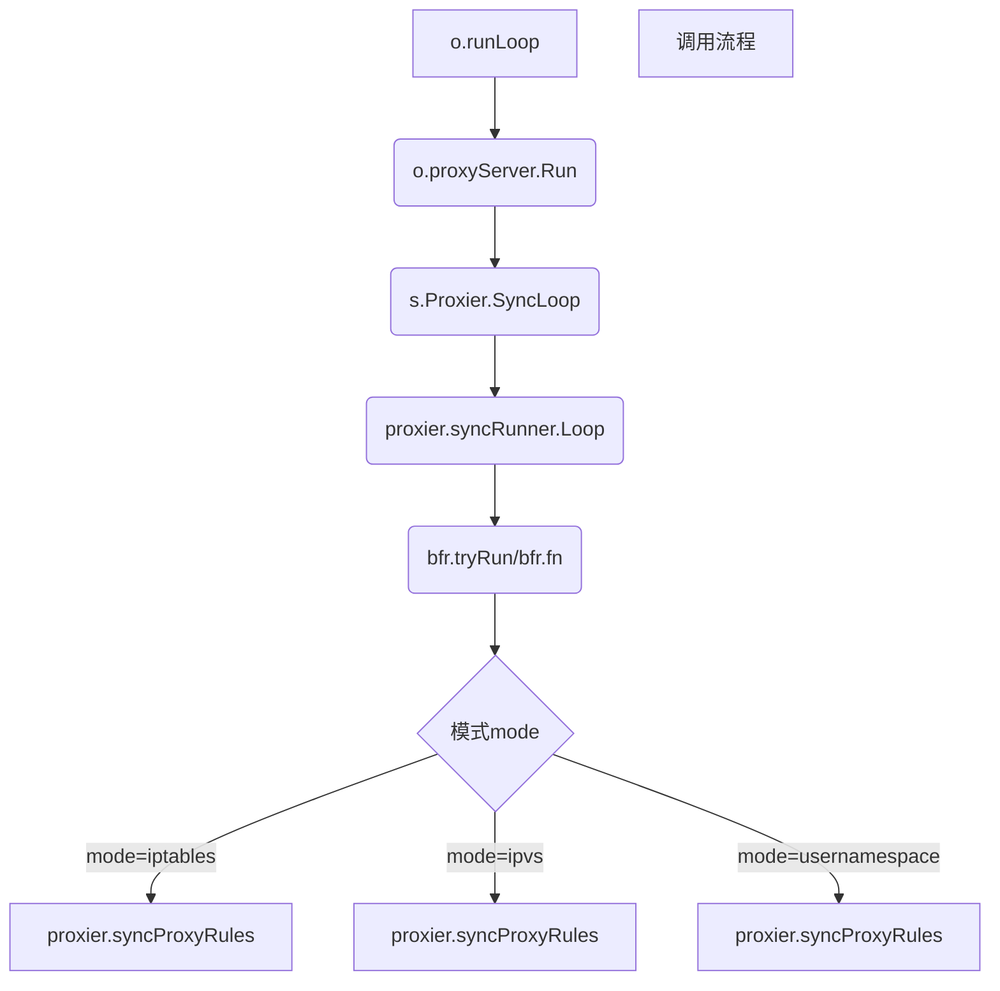

### 环境

- Kubernetes v1.14.6
- Etcd 3.3.12
- Docker 18.09.9

### K8s service

service是一堆相同label pod集合的抽象，通过selector标签来匹配pod;
服务间访问也通过service(域名)，用service可以避免pod ip迁移发生变化；service对象也会对应多个
endpoint对象，endpoint用于服务发现；无论是service、endpoint都是逻辑概念，真正路由转发是
kube-proxy，通常以daemonset形式运行于集群中，kube-proxy会watch service、endpoint变化，
生成/改变宿主机上的iptables/ipvs转发规则

service类型：
- ClusterIP(默认)
- NodePort
- LoadBalancer
- ExternelName

headless service: 没有clusterIP的service, 给应用集群的每个pod分配一个dns域名，pod之间
用该域名直接访问，mysql/redis等集群都是这种方式

提下ingress, ingress不是service类型，作用于7层，是外部访问内部应用的入口；
不同的域名/路径来匹配不同的service

### kube-proxy模式

kube-proxy模式：
- userspace(这里不介绍，有了iptables)
- iptables(userspace的改进)
- ipvs
- kernelspace(windows下使用)

IPVS vs. IPTABLES:

IPVS模式在Kubernetes v1.8中引入，在v1.9中处于beta版本，在v1.11中处于GA版本。 
IPTABLES模式已在v1.1中添加，并成为v1.2之后的默认操作模式。 IPVS和IPTABLES均基于netfilter。 

IPVS模式和IPTABLES模式之间的差异如下：
1. IPVS为大型群集提供了更好的可伸缩性和性能。
2. 与IPTABLES相比，IPVS支持更复杂的负载平衡算法（最低负载，最少连接，局部性，加权等）。
3. IPVS支持服务器运行状况检查和连接重试等。
4. 底层数据结构：IPTABLES使用链表，IPVS使用哈希表

#### iptables模式

iptables 5张表5条链

5张表:
- filter: 过滤某个链上的数据包
- nat: 网络地址转换，转换数据包的源地址和目的地址
- mangle: 修改数据包的IP头部信息
- raw: iptables本身是有状态的，对数据包有链接追踪(/proc/net/nf_conntrack可看到)，raw
可以用来消除这种追踪机制
- security: 数据包上使用selinux

5条链:
- PREROUTING: 数据包进入内核网络模块之后, 获得路由之前(可进行DNAT)
- INPUT: 数据包被决定路由到本机之后, 一般处理本地进程的数据包, 目的地址是本机
- FORWARD: 数据包被决定路由到其他主机之后, 一般处理转发到其它主机/网络命名空间的数据包
- OUTPUT: 离开本机的数据包进入内核网络模块之后, 一般处理本地进程的输出数据包, 源地址是本机
- POSTROUTING: 对于离开本机或者FORWARD的数据包, 当数据包被发送到网卡之前(可进行SNAT) 

iptables的表和链是有顺序的，工作流程如下:


kube-proxy iptables模式使用了filter和nat表，并定义了很多自定义链

filter表自定义链:
- KUBE-SERVICES
- KUBE-EXTERNAL-SERVICES
- KUBE-FIREWALL

nat表自定义链:

- KUBE-HOSTPORTS
- KUBE-SERVICES
- KUBE-POSTROUTING
- KUBE-MARK-DROP
- KUBE-MARK-MASQ
- KUBE-NODEPORTS
- KUBE-SVC-XXX
- KUBE-SEP-XXX

具体来看kube-proxy生成的iptables规则, 以一个httpbin服务为例

httpbin的k8s manifest
```
# vim httpbin.yaml 
---
apiVersion: v1
kind: Service
metadata:
  name: httpbin
  labels:
    app: httpbin
spec:
  ports:
  - name: http
    port: 80
    targetPort: 80
  selector:
    app: httpbin
---
apiVersion: apps/v1
kind: Deployment
metadata:
  name: httpbin
spec:
  replicas: 1
  selector:
    matchLabels:
      app: httpbin
  template:
    metadata:
      labels:
        app: httpbin
    spec:
      containers:
      - image: docker.io/kennethreitz/httpbin
        name: httpbin
        ports:
        - containerPort: 80
```

```
# kubectl apply -f httpbin.yaml 
service/httpbin created
deployment.apps/httpbin created
```

```
# kubectl get svc -l app=httpbin
NAME      TYPE        CLUSTER-IP      EXTERNAL-IP   PORT(S)   AGE
httpbin   ClusterIP   172.20.255.90   <none>        80/TCP    2m38s

# kubectl get pod -l app=httpbin
NAME                     READY   STATUS    RESTARTS   AGE
httpbin-896cb847-vwpg2   1/1     Running   0          2m45s
```
clusterIP为172.20.255.90，pod单副本

##### clusterIP service类型

pod间访问clusterIP的iptables规则链顺序为：(对照上面的iptables工作流程图)
```
PREROUTING -> KUBE-SERVICES -> KUBE-SVC-XXX -> KUBE-SEP-XXX
```

```
1. 进入PREROUTING的规则都转发到KUBE-SERVICES, 不符合KUBE-HOSTPORTS的条件
-A PREROUTING -m comment --comment "kube hostport portals" -m addrtype --dst-type LOCAL -j KUBE-HOSTPORTS
-A PREROUTING -m comment --comment "kubernetes service portals" -j KUBE-SERVICES

2. 访问clusterIP为172.20.255.90的都转发至KUBE-SVC-FREKB6WNWYJLKTHC
-A KUBE-SERVICES -d 172.20.255.90/32 -p tcp -m comment --comment "default/httpbin:http cluster IP" -m tcp --dport 80 -j KUBE-SVC-FREKB6WNWYJLKTHC

3. 进入KUBE-SVC-FREKB6WNWYJLKTHC的都转发至KUBE-SEP-PEA6WHECIZEOX47B
-A KUBE-SVC-FREKB6WNWYJLKTHC -j KUBE-SEP-PEA6WHECIZEOX47B

4. KUBE-SEP-PEA6WHECIZEOX47B对应endpoint中的172.20.0.40:80
-A KUBE-SEP-PEA6WHECIZEOX47B -s 172.20.0.40/32 -j KUBE-MARK-MASQ
-A KUBE-SEP-PEA6WHECIZEOX47B -p tcp -m tcp -j DNAT --to-destination 172.20.0.40:80

# 0x4000是kube-proxy的数据包放行标记, 0x8000是数据包丢弃标记
-A KUBE-MARK-DROP -j MARK --set-xmark 0x8000/0x8000
-A KUBE-MARK-MASQ -j MARK --set-xmark 0x4000/0x4000
```

httpbin pod副本数扩到2，观察iptables KUBE-SVC-，KUBE-SEP-链的变化
```
# kubectl scale deployment httpbin --replicas=2 
deployment.extensions/httpbin scaled

-A KUBE-SVC-FREKB6WNWYJLKTHC -m statistic --mode random --probability 0.50000000000 -j KUBE-SEP-PEA6WHECIZEOX47B
-A KUBE-SVC-FREKB6WNWYJLKTHC -j KUBE-SEP-UHAR347MOFCEOPWZ

-A KUBE-SEP-UHAR347MOFCEOPWZ -s 172.20.1.183/32 -j KUBE-MARK-MASQ
-A KUBE-SEP-UHAR347MOFCEOPWZ -p tcp -m tcp -j DNAT --to-destination 172.20.1.183:80
```

httpbin pod副本数扩到3，观察iptables KUBE-SVC-，KUBE-SEP-链的变化
```
# 3副本, 每个都是1/3概率
-A KUBE-SVC-FREKB6WNWYJLKTHC -m statistic --mode random --probability 0.33332999982 -j KUBE-SEP-PEA6WHECIZEOX47B
# probability=(1-0.33332999982)/2=0.50000000000
-A KUBE-SVC-FREKB6WNWYJLKTHC -m statistic --mode random --probability 0.50000000000 -j KUBE-SEP-JXNDCT5ED2555YYJ
-A KUBE-SVC-FREKB6WNWYJLKTHC -j KUBE-SEP-UHAR347MOFCEOPWZ

-A KUBE-SEP-UHAR347MOFCEOPWZ -s 172.20.1.183/32 -j KUBE-MARK-MASQ
-A KUBE-SEP-UHAR347MOFCEOPWZ -p tcp -m tcp -j DNAT --to-destination 172.20.1.183:80
```

##### nodePort service类型

httpbin svc修改为nodePort类型
```
[root@ice ~]# kubectl get svc 
NAME                       TYPE        CLUSTER-IP       EXTERNAL-IP   PORT(S)                                 AGE
httpbin                    NodePort    172.20.255.90    <none>        80:11387/TCP   
```

非本地访问nodePort的iptables规则链顺序为:
```
PREROUTING -> KUBE-SERVICES -> KUBE-NODEPORTS -> KUBE-SVC-XXX -> KUBE-SEP-XXX
```

```
1. 进入PREROUTING的规则都转发到KUBE-SERVICES, 不符合KUBE-HOSTPORTS的条件
-A PREROUTING -m comment --comment "kube hostport portals" -m addrtype --dst-type LOCAL -j KUBE-HOSTPORTS
-A PREROUTING -m comment --comment "kubernetes service portals" -j KUBE-SERVICES

2. 优先处理clusterIP
-A KUBE-SERVICES -d 172.20.255.90/32 -p tcp -m comment --comment "default/httpbin:http cluster IP" -m tcp --dport 80 -j KUBE-SVC-FREKB6WNWYJLKTHC

3. 进入KUBE-SERVICES的规则, 优先处理clusterIP，最后都转发到KUBE-NODEPORTS
-A KUBE-SERVICES -m comment --comment "kubernetes service nodeports; NOTE: this must be the last rule in this chain" -m addrtype --dst-type LOCAL -j KUBE-NODEPORTS

4. 接下来就跟上述clusterIP类型的流程一样了
-A KUBE-NODEPORTS -p tcp -m comment --comment "default/httpbin:http" -m tcp --dport 11387 -j KUBE-MARK-MASQ
-A KUBE-NODEPORTS -p tcp -m comment --comment "default/httpbin:http" -m tcp --dport 11387 -j KUBE-SVC-FREKB6WNWYJLKTHC

5.
-A KUBE-SVC-FREKB6WNWYJLKTHC -m statistic --mode random --probability 0.33332999982 -j KUBE-SEP-PEA6WHECIZEOX47B
-A KUBE-SVC-FREKB6WNWYJLKTHC -m statistic --mode random --probability 0.50000000000 -j KUBE-SEP-JXNDCT5ED2555YYJ
-A KUBE-SVC-FREKB6WNWYJLKTHC -j KUBE-SEP-UHAR347MOFCEOPWZ

6. 
-A KUBE-SEP-PEA6WHECIZEOX47B -s 172.20.0.40/32 -j KUBE-MARK-MASQ
-A KUBE-SEP-PEA6WHECIZEOX47B -p tcp -m tcp -j DNAT --to-destination 172.20.0.40:80
-A KUBE-SEP-JXNDCT5ED2555YYJ -s 172.20.0.41/32 -j KUBE-MARK-MASQ
-A KUBE-SEP-JXNDCT5ED2555YYJ -p tcp -m tcp -j DNAT --to-destination 172.20.0.41:80
-A KUBE-SEP-UHAR347MOFCEOPWZ -s 172.20.1.183/32 -j KUBE-MARK-MASQ
-A KUBE-SEP-UHAR347MOFCEOPWZ -p tcp -m tcp -j DNAT --to-destination 172.20.1.183:80
```

本地访问nodePort的iptables规则链顺序为:
```
OUTPUT -> KUBE-SERVICES -> KUBE-NODEPORTS -> KUBE-SVC-XXX -> KUBE-SEP-XXX
```

```
1. 进入PREROUTING的规则都转发到KUBE-SERVICES都转发至KUBE-SERVICES
-A OUTPUT -m comment --comment "kube hostport portals" -m addrtype --dst-type LOCAL -j KUBE-HOSTPORTS
-A OUTPUT -m comment --comment "kubernetes service portals" -j KUBE-SERVICES

2. 优先处理clusterIP
-A KUBE-SERVICES -d 172.20.255.90/32 -p tcp -m comment --comment "default/httpbin:http cluster IP" -m tcp --dport 80 -j KUBE-SVC-FREKB6WNWYJLKTHC

3. 进入KUBE-SERVICES的规则, 优先处理clusterIP，最后都转发到KUBE-NODEPORTS
-A KUBE-SERVICES -m comment --comment "kubernetes service nodeports; NOTE: this must be the last rule in this chain" -m addrtype --dst-type LOCAL -j KUBE-NODEPORTS

4. 接下来就跟上述clusterIP类型的流程一样了
-A KUBE-NODEPORTS -p tcp -m comment --comment "default/httpbin:http" -m tcp --dport 11387 -j KUBE-MARK-MASQ
-A KUBE-NODEPORTS -p tcp -m comment --comment "default/httpbin:http" -m tcp --dport 11387 -j KUBE-SVC-FREKB6WNWYJLKTHC

5.
-A KUBE-SVC-FREKB6WNWYJLKTHC -m statistic --mode random --probability 0.33332999982 -j KUBE-SEP-PEA6WHECIZEOX47B
-A KUBE-SVC-FREKB6WNWYJLKTHC -m statistic --mode random --probability 0.50000000000 -j KUBE-SEP-JXNDCT5ED2555YYJ
-A KUBE-SVC-FREKB6WNWYJLKTHC -j KUBE-SEP-UHAR347MOFCEOPWZ

6. 
-A KUBE-SEP-PEA6WHECIZEOX47B -s 172.20.0.40/32 -j KUBE-MARK-MASQ
-A KUBE-SEP-PEA6WHECIZEOX47B -p tcp -m tcp -j DNAT --to-destination 172.20.0.40:80
-A KUBE-SEP-JXNDCT5ED2555YYJ -s 172.20.0.41/32 -j KUBE-MARK-MASQ
-A KUBE-SEP-JXNDCT5ED2555YYJ -p tcp -m tcp -j DNAT --to-destination 172.20.0.41:80
-A KUBE-SEP-UHAR347MOFCEOPWZ -s 172.20.1.183/32 -j KUBE-MARK-MASQ
-A KUBE-SEP-UHAR347MOFCEOPWZ -p tcp -m tcp -j DNAT --to-destination 172.20.1.183:80
```

#### ipvs模式

ipvs有三种负载均衡模式：
- NAT(k8s用这种模式)
- DR
- TUN

linux内核中的ipvs只有DNAT，没有SNAT; ipvs会使用iptables进行包过滤、SNAT、MASQUERADE。
具体来说，ipvs使用ipset来存储需要NAT或masquared时的ip和端口列表。ipset是iptables的扩展，
允许你创建匹配整个地址sets（地址集合)的规则。而不像普通的iptables链是线性的存储和过滤，
ip集合存储在带索引的数据结构中,这种集合比较大也可以进行高效的查找。

SNAT vs MASQUERADE区别：MASQUERADE不需要指定SNAT的目标ip，自动获取


ipvs工作流程图


启用ipvs模式
```
# yum install -y ipset ipvsadm

# cat << 'EOF' > ipvs.modules
#!/bin/bash
ipvs_modules=(ip_vs ip_vs_lc ip_vs_wlc ip_vs_rr ip_vs_wrr ip_vs_lblc ip_vs_lblcr ip_vs_dh ip_vs_sh ip_vs_fo ip_vs_nq ip_vs_sed ip_vs_ftp nf_conntrack_ipv4)
for kernel_module in ${ipvs_modules[*]}; do
/sbin/modinfo -F filename ${kernel_module} > /dev/null 2>&1
if [ $? -eq 0 ]; then
   /sbin/modprobe ${kernel_module}
fi
done
EOF

# bash ipvs.modules
# cut -f1 -d " "  /proc/modules | grep -E "ip_vs|nf_conntrack_ipv4"

# kubectl -n kube-system edit cm kube-proxy
mode: "ipvs"

# kubectl -n kube-system get pod -l k8s-app=kube-proxy | grep -v 'NAME' | awk '{print $1}' | xargs kubectl -n kube-system delete pod

# iptables -t filter -F; iptables -t filter -X; iptables -t nat -F; iptables -t nat -X;
```

kube-proxy ipvs模式使用了nat表和filter表，也定义自定义链

filter表：
- KUBE-FIREWALL
- KUBE-FORWARD

nat表：
- KUBE-FIREWALL
- KUBE-HOSTPORTS
- KUBE-LOAD-BALANCER 
- KUBE-MARK-DROP
- KUBE-MARK-MASQ
- KUBE-NODE-PORT
- KUBE-POSTROUTING 
- KUBE-SERVICES

ipvs模式下的clusterIP，是可以ping通的，它在宿主机上是真实存在的ip; 因为ipvs的DNAT用到的netfilter hook函数是
作用在INPUT链上，clusterIP会绑定在本机dummy网卡，默认名为kube-ipvs0，内核网络栈识别
到这是本机的IP，从而进入INPUT链；发送的包时候再从POSTROUTING出.

还是以上面httpbin的例子

```
# kubectl get svc httpbin 
NAME      TYPE        CLUSTER-IP      EXTERNAL-IP   PORT(S)   AGE
httpbin   ClusterIP   172.20.255.90   <none>        80/TCP    9d
```
httpbin clusterIP为172.20.255.90(3副本)

##### clusterIP service类型

访问clusterIP iptables规则链顺序为: (结合上面ipvs工作流程图)
```
PREROUTING -> KUBE-SERVICES -> KUBE-CLUSTER-IP(ipset) -> INPUT -> KUBE-FIREWALL -> POSTROUTING
```

```
1. 进入PREROUTING链
-A PREROUTING -m comment --comment "kubernetes service portals" -j KUBE-SERVICES

2. 跳转至KUBE-SERVICES
-A KUBE-SERVICES -m comment --comment "Kubernetes service cluster ip + port for masquerade purpose" -m set --match-set KUBE-CLUSTER-IP src,dst -j KUBE-MARK-MASQ

3. 进入KUBE-CLUSTER-IP ipset
[root@ice ~]# ipset list |grep -A 30 KUBE-CLUSTER-IP
Name: KUBE-CLUSTER-IP
Type: hash:ip,port
Revision: 2
Header: family inet hashsize 1024 maxelem 65536
Size in memory: 17392
References: 2
Members:
172.20.255.218,tcp:8001
172.20.253.100,tcp:8080
172.20.254.248,tcp:25672
172.20.255.183,tcp:443
172.20.254.248,tcp:15672
172.20.252.10,udp:53
172.20.253.103,tcp:8080
172.20.253.243,tcp:44134
172.20.254.248,tcp:5672
172.20.253.137,tcp:9100
172.20.252.136,tcp:9090
172.20.255.125,tcp:80
172.20.254.248,tcp:4369
172.20.255.100,tcp:80
172.20.252.130,tcp:56790
172.20.255.183,tcp:80
172.20.253.196,tcp:5432
172.20.252.130,tcp:80
172.20.255.57,tcp:443
172.20.253.20,tcp:80
172.20.252.130,tcp:443
172.20.252.10,tcp:53
172.20.254.170,tcp:8080
172.20.255.90,tcp:80     # httpbin clusterIP

4. 再跳转至KUBE-MARK-MASQ，打上标记
-A KUBE-MARK-MASQ -j MARK --set-xmark 0x4000/0x4000

5. 又进入KUBE-CLUSTER-IP ipset, 进行DNAT
-A KUBE-SERVICES -m set --match-set KUBE-CLUSTER-IP dst,dst -j ACCEPT

6. 查看ipvs规则，clusterIP真正存在于宿主机的kube-ipvs0网卡上
# ipvsadm  -L -n |grep -A 3 172.20.255.90
TCP  172.20.255.90:80 rr
  -> 172.20.0.40:80               Masq    1      0          0         
  -> 172.20.0.41:80               Masq    1      0          0         
  -> 172.20.1.183:80              Masq    1      0          0 

# ip a show kube-ipvs0 |grep -A 2 172.20.255.90
    inet 172.20.255.90/32 brd 172.20.255.90 scope global kube-ipvs0
       valid_lft forever preferred_lft forever

7. 进入INPUT链
-A INPUT -j KUBE-FIREWALL

8. 跳转至KUBE-FIREWALL，有0x8000标记，即丢弃
-A KUBE-FIREWALL -m comment --comment "kubernetes firewall for dropping marked packets" -m mark --mark 0x8000/0x8000 -j DROP

9. 进入INPUT链后，ipvs的ip_vs_in hook函数根据ipvs规则直接转发至POSTROUTING链
-A POSTROUTING -m comment --comment "kubernetes postrouting rules" -j KUBE-POSTROUTING

10. 标记0x4000的包，正常MASQUERADE(类SNAT)
-A KUBE-POSTROUTING -m comment --comment "kubernetes service traffic requiring SNAT" -m mark --mark 0x4000/0x4000 -j MASQUERADE
```

##### nodePort service类型

非本地访问nodePort的iptables规则链顺序为:
```
PREROUTING -> KUBE-SERVICES -> KUBE-NODE-PORT -> INPUT --> KUBE-FIREWALL --> POSTROUTING
```

本地访问nodePort的iptables规则链顺序为:
```
OUTPUT -> KUBE-SERVICES -> KUBE-NODE-PORT -> INPUT --> KUBE-FIREWALL --> POSTROUTING
```
分析过程与上述类似.


### kube-proxy代码

启动函数
```
k8s.io/kubernetes/cmd/kube-proxy/proxy.go

func main() {
	rand.Seed(time.Now().UnixNano())

	command := app.NewProxyCommand()

	// TODO: once we switch everything over to Cobra commands, we can go back to calling
	// utilflag.InitFlags() (by removing its pflag.Parse() call). For now, we have to set the
	// normalize func and add the go flag set by hand.
	pflag.CommandLine.SetNormalizeFunc(cliflag.WordSepNormalizeFunc)
	pflag.CommandLine.AddGoFlagSet(goflag.CommandLine)
	// utilflag.InitFlags()
	logs.InitLogs()
	defer logs.FlushLogs()

	if err := command.Execute(); err != nil {
		fmt.Fprintf(os.Stderr, "error: %v\n", err)
		os.Exit(1)
	}
}
```

进入到Run函数
```
k8s.io/kubernetes/cmd/kube-proxy/app/server.go

func (o *Options) Run() error {
	defer close(o.errCh)   
    // 配置写到文件
	if len(o.WriteConfigTo) > 0 {
		return o.writeConfigFile()
	}
    // 初始化proxyServer对象
	proxyServer, err := NewProxyServer(o)
	if err != nil {
		return err
	}
    // 如果为true，执行
	if o.CleanupAndExit {
		return proxyServer.CleanupAndExit()
	}

	o.proxyServer = proxyServer
	return o.runLoop()
}
```

NewProxyServer函数 - 初始化proxyServer对象
```
func newProxyServer(
	config *proxyconfigapi.KubeProxyConfiguration,
	cleanupAndExit bool,
	scheme *runtime.Scheme,
	master string) (*ProxyServer, error) {
    // config必须有值
	if config == nil {
		return nil, errors.New("config is required")
	}
    // 初始化configz.Config对象
	if c, err := configz.New(proxyconfigapi.GroupName); err == nil {
		c.Set(config)
	} else {
		return nil, fmt.Errorf("unable to register configz: %s", err)
	}
    // 支持ipv4,ipv6
	protocol := utiliptables.ProtocolIpv4
	if net.ParseIP(config.BindAddress).To4() == nil {
		klog.V(0).Infof("IPv6 bind address (%s), assume IPv6 operation", config.BindAddress)
		protocol = utiliptables.ProtocolIpv6
	}
    // 初始化变量
	var iptInterface utiliptables.Interface
	var ipvsInterface utilipvs.Interface
	var kernelHandler ipvs.KernelHandler
	var ipsetInterface utilipset.Interface
	var dbus utildbus.Interface

    // 封装了os/exec
	// Create a iptables utils.
	execer := exec.New()

    // 封装了github.com/godbus/dbus，一个与D-Bus交互的golang库
	dbus = utildbus.New()
    // 初始化操作iptables的对象，针对iptables版本做了check
	iptInterface = utiliptables.New(execer, dbus, protocol)
    // 初始化操作ipvs模块的对象
	kernelHandler = ipvs.NewLinuxKernelHandler()
    // 初始化操作ipset的对象
	ipsetInterface = utilipset.New(execer)
    // 检查ipvs，ipset版本；会尝试在kube-proxy容器里自动加载ipvs所需模块
	canUseIPVS, _ := ipvs.CanUseIPVSProxier(kernelHandler, ipsetInterface)
	if canUseIPVS {
        // 初始化操作ipvs的对象
		ipvsInterface = utilipvs.New(execer)
	}

	// We omit creation of pretty much everything if we run in cleanup mode
	if cleanupAndExit {
		return &ProxyServer{
			execer:         execer,
			IptInterface:   iptInterface,
			IpvsInterface:  ipvsInterface,
			IpsetInterface: ipsetInterface,
		}, nil
	}
    // 初始化clientset
	client, eventClient, err := createClients(config.ClientConnection, master)
	if err != nil {
		return nil, err
	}

	// Create event recorder
	hostname, err := utilnode.GetHostname(config.HostnameOverride)
	if err != nil {
		return nil, err
	}
	eventBroadcaster := record.NewBroadcaster()
	recorder := eventBroadcaster.NewRecorder(scheme, v1.EventSource{Component: "kube-proxy", Host: hostname})

	nodeRef := &v1.ObjectReference{
		Kind:      "Node",
		Name:      hostname,
		UID:       types.UID(hostname),
		Namespace: "",
	}

	var healthzServer *healthcheck.HealthzServer
	var healthzUpdater healthcheck.HealthzUpdater
	if len(config.HealthzBindAddress) > 0 {
		healthzServer = healthcheck.NewDefaultHealthzServer(config.HealthzBindAddress, 2*config.IPTables.SyncPeriod.Duration, recorder, nodeRef)
		healthzUpdater = healthzServer
	}

	var proxier proxy.ProxyProvider
	var serviceEventHandler proxyconfig.ServiceHandler
	var endpointsEventHandler proxyconfig.EndpointsHandler

    // 获取kube-proxy模式，不指定的走iptables模式；检测该模式前置条件失败的话会尝试下一个模式
    // 顺序依次为ipvs -> iptables -> usernamespace
	proxyMode := getProxyMode(string(config.Mode), iptInterface, kernelHandler, ipsetInterface, iptables.LinuxKernelCompatTester{})
	nodeIP := net.ParseIP(config.BindAddress)
	if nodeIP.IsUnspecified() {
		nodeIP = utilnode.GetNodeIP(client, hostname)
	}
	if proxyMode == proxyModeIPTables {
		klog.V(0).Info("Using iptables Proxier.")
		if config.IPTables.MasqueradeBit == nil {
			// MasqueradeBit must be specified or defaulted.
			return nil, fmt.Errorf("unable to read IPTables MasqueradeBit from config")
		}
        // 初始化iptables proxier对象
		// TODO this has side effects that should only happen when Run() is invoked.
		proxierIPTables, err := iptables.NewProxier(
			iptInterface,
			utilsysctl.New(),
			execer,
			config.IPTables.SyncPeriod.Duration,
			config.IPTables.MinSyncPeriod.Duration,
			config.IPTables.MasqueradeAll,
			int(*config.IPTables.MasqueradeBit),
			config.ClusterCIDR,
			hostname,
			nodeIP,
			recorder,
			healthzUpdater,
			config.NodePortAddresses,
		)
		if err != nil {
			return nil, fmt.Errorf("unable to create proxier: %v", err)
		}
		metrics.RegisterMetrics()
		proxier = proxierIPTables
		serviceEventHandler = proxierIPTables
		endpointsEventHandler = proxierIPTables
	} else if proxyMode == proxyModeIPVS {
		klog.V(0).Info("Using ipvs Proxier.")
        // 初始化ipvs proxier对象
		proxierIPVS, err := ipvs.NewProxier(
			iptInterface,
			ipvsInterface,
			ipsetInterface,
			utilsysctl.New(),
			execer,
			config.IPVS.SyncPeriod.Duration,
			config.IPVS.MinSyncPeriod.Duration,
			config.IPVS.ExcludeCIDRs,
			config.IPVS.StrictARP,
			config.IPTables.MasqueradeAll,
			int(*config.IPTables.MasqueradeBit),
			config.ClusterCIDR,
			hostname,
			nodeIP,
			recorder,
			healthzServer,
			config.IPVS.Scheduler,
			config.NodePortAddresses,
		)
		if err != nil {
			return nil, fmt.Errorf("unable to create proxier: %v", err)
		}
		metrics.RegisterMetrics()
		proxier = proxierIPVS
		serviceEventHandler = proxierIPVS
		endpointsEventHandler = proxierIPVS
	} else {
		klog.V(0).Info("Using userspace Proxier.")
		// This is a proxy.LoadBalancer which NewProxier needs but has methods we don't need for
		// our config.EndpointsConfigHandler.
		loadBalancer := userspace.NewLoadBalancerRR()
		// set EndpointsConfigHandler to our loadBalancer
		endpointsEventHandler = loadBalancer

		// TODO this has side effects that should only happen when Run() is invoked.
		proxierUserspace, err := userspace.NewProxier(
			loadBalancer,
			net.ParseIP(config.BindAddress),
			iptInterface,
			execer,
			*utilnet.ParsePortRangeOrDie(config.PortRange),
			config.IPTables.SyncPeriod.Duration,
			config.IPTables.MinSyncPeriod.Duration,
			config.UDPIdleTimeout.Duration,
			config.NodePortAddresses,
		)
		if err != nil {
			return nil, fmt.Errorf("unable to create proxier: %v", err)
		}
		serviceEventHandler = proxierUserspace
		proxier = proxierUserspace
	}

	iptInterface.AddReloadFunc(proxier.Sync)

	return &ProxyServer{
		Client:                 client,
		EventClient:            eventClient,
		IptInterface:           iptInterface,
		IpvsInterface:          ipvsInterface,
		IpsetInterface:         ipsetInterface,
		execer:                 execer,
		Proxier:                proxier,
		Broadcaster:            eventBroadcaster,
		Recorder:               recorder,
		ConntrackConfiguration: config.Conntrack,
		Conntracker:            &realConntracker{},
		ProxyMode:              proxyMode,
		NodeRef:                nodeRef,
		MetricsBindAddress:     config.MetricsBindAddress,
		EnableProfiling:        config.EnableProfiling,
		OOMScoreAdj:            config.OOMScoreAdj,
		ResourceContainer:      config.ResourceContainer,
		ConfigSyncPeriod:       config.ConfigSyncPeriod.Duration,
		ServiceEventHandler:    serviceEventHandler,
		EndpointsEventHandler:  endpointsEventHandler,
		HealthzServer:          healthzServer,
	}, nil
}
```


接下来的调用流程：



最终会根据不同模式，调用到proxier.syncProxyRules；创建相应的iptables规则、ipvs规则，都是具体的命令；这个函数也比较长，可以一条一条规则对着分析.


### 参考链接

- [iptables vs ipvs](https://github.com/kubernetes/kubernetes/blob/master/pkg/proxy/ipvs/README.md)
- [http://www.austintek.com/LVS/LVS-HOWTO/HOWTO/LVS-HOWTO.filter_rules.html](http://www.austintek.com/LVS/LVS-HOWTO/HOWTO/LVS-HOWTO.filter_rules.html)
- [https://blog.tianfeiyu.com/source-code-reading-notes/kubernetes/kube_proxy_ipvs.html](https://blog.tianfeiyu.com/source-code-reading-notes/kubernetes/kube_proxy_ipvs.html)
- [https://zhuanlan.zhihu.com/p/37230013](https://zhuanlan.zhihu.com/p/37230013)
