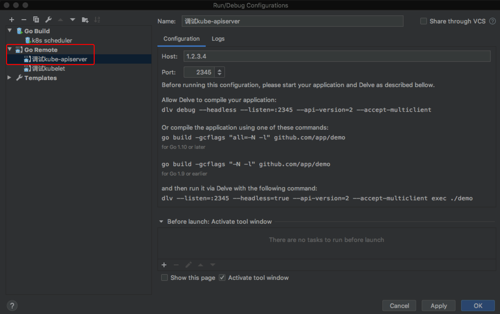
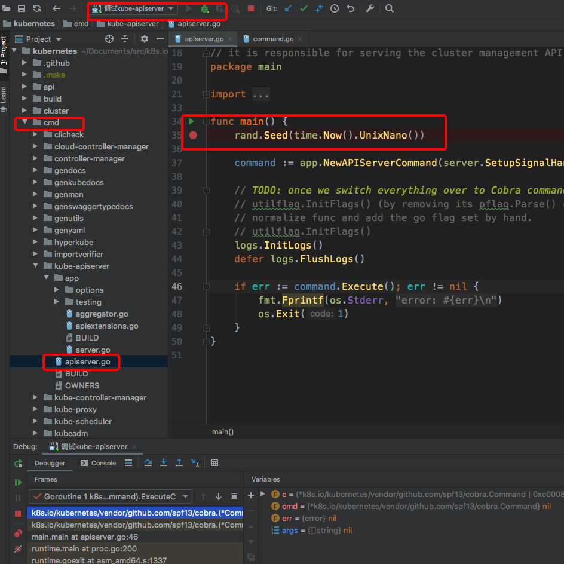
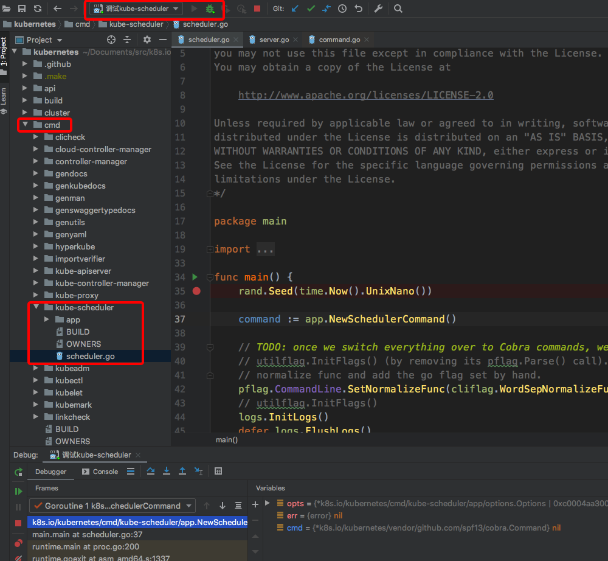
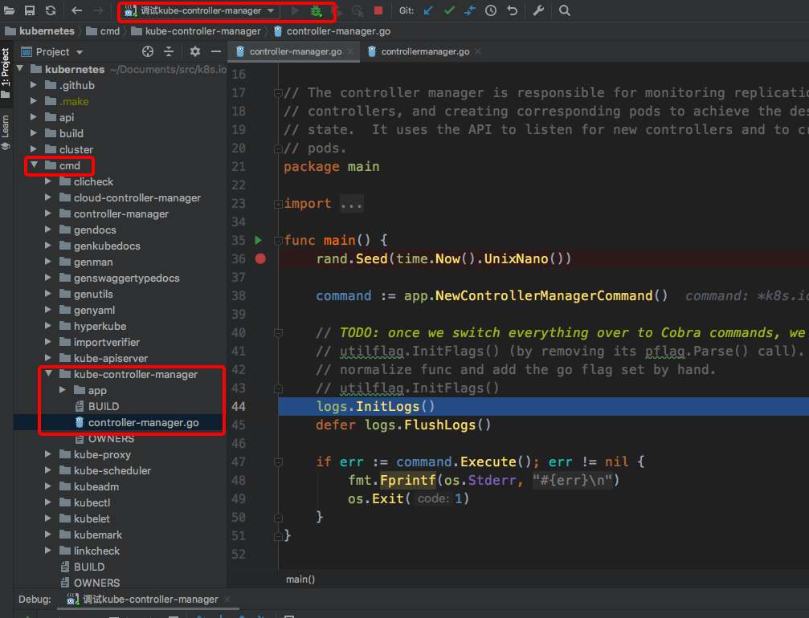
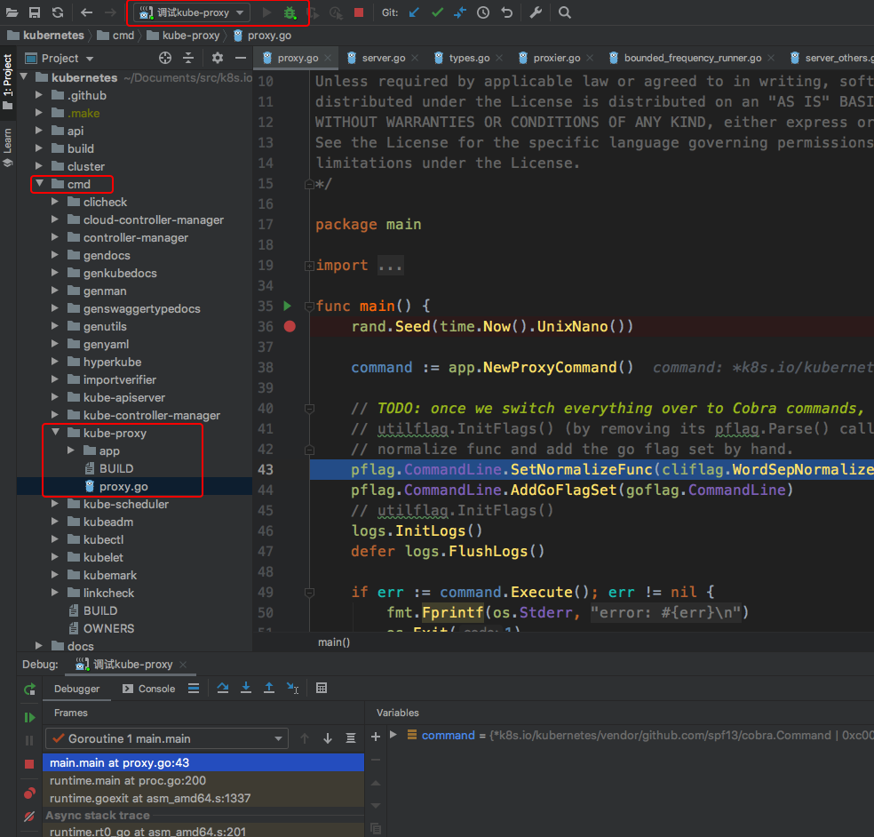
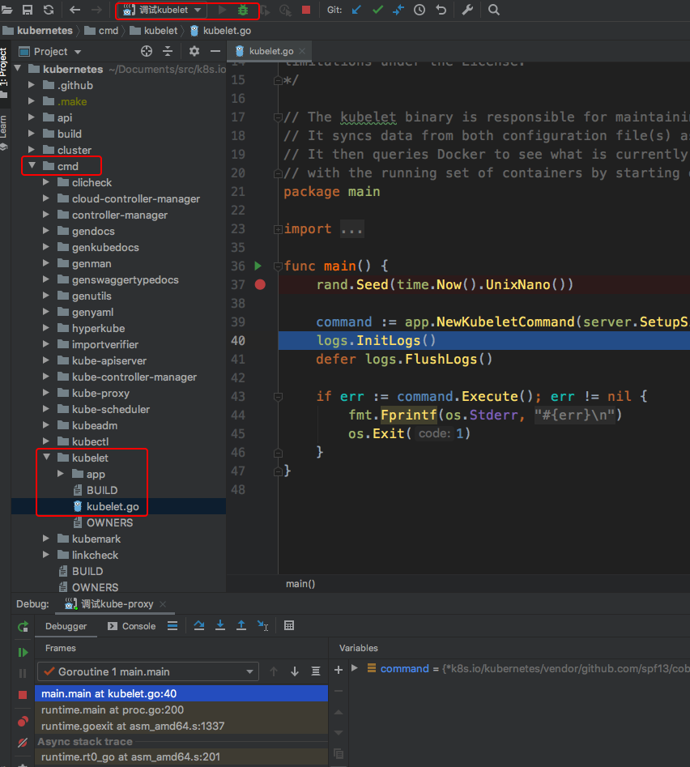

本文讲述k8s各个系统组件如何进行远程调试, 适用于所有mac、windows以及不方便在本地进行调试的技术宅; 
像k8s代码量如此庞大的系统, 调试代码让你更深入地理解逻辑，代码间的跳转更易跟踪，通过打印变量映证你的猜想.


## 准备阶段

1. Goland IDE
  
   工欲善必先利其器, Goland集成了dlv调试工具, dlv和gdb都可以用来调试golang程序，
   但是dlv相比gdb在调试goroutine方面支持更好. [Goland下载地址](https://www.jetbrains.com/go/download)

2. Kubernetes开发环境+golang环境+dlv+kubernetes源码

   在远端linux服务器上安装一套kubernetes环境，可以用kubeadm工具安装；

   安装golang环境+dlv+kubernetes源码，方便重编译k8s二进制，默认k8s二进制开启了编译优化，

   忽略了debug信息；dlv用来启个debug server提供给本地IDE远程调试使用；

   环境版本：

    - Kubernetes：v1.14.6
    - Etcd：3.3.12
    - Docker：18.09.9

   - dlv：1.4.0
   - Golang：1.12.7

3. 本地clone kubernetes代码

   ```bash
   mkdir -p $GOPATH/src/k8s.io/
   ```
   
   ```bash
   # cd $GOPATH/src/k8s.io/
   ```
   
   克隆kubernetes源码
   ```bash
   # git clone https://github.com/kubernetes/kubernetes.git
   ```
   
   切换到与上面k8s环境版本相同的tag
   ```bash
   # git checkout v1.14.6
   ```


## 备战阶段

1. 修改编译参数

   在v1.14.6版本编译二进制的时候，默认编译参数写死了加上-s -w选项

   -s disable symbol table      禁用符号表
   -w disable DWARF generation  禁用调试信息

   更多编译参数帮助信息查看：go tool link

   ```go
   vim k8s.io/kubernetes/hack/lib/golang.sh
   # goldflags="${GOLDFLAGS:-} -s -w $(kube::version::ldflags)"
   goldflags="${GOLDFLAGS:-} $(kube::version::ldflags)"
   ```

2. 重编译k8s二进制

   因为默认k8s二进制开启了编译优化，忽略了debug信息

   ```bash
   [root@ice /data/Documents/src/k8s.io/kubernetes]# GO111MODULE=off KUBE_GIT_TREE_STATE=clean KUBE_GIT_VERSION=v1.14.6 make all GOGCFLAGS="all=-N -l"
   +++ [0425 17:34:35] Building go targets for linux/amd64:
       cmd/kube-proxy
       cmd/kube-apiserver
       cmd/kube-controller-manager
       cmd/cloud-controller-manager
       cmd/kubelet
       cmd/kubeadm
       cmd/hyperkube
       cmd/kube-scheduler
       vendor/k8s.io/apiextensions-apiserver
       cluster/gce/gci/mounter
       cmd/kubectl
       cmd/gendocs
       cmd/genkubedocs
       cmd/genman
       cmd/genyaml
       cmd/genswaggertypedocs
       cmd/linkcheck
       vendor/github.com/onsi/ginkgo/ginkgo
       test/e2e/e2e.test
       cmd/kubemark
       vendor/github.com/onsi/ginkgo/ginkgo
       test/e2e_node/e2e_node.test
   
   ```

   ```bash
   [root@ice /data/Documents/src/k8s.io/kubernetes]# ll _output/bin/
   total 2893888
   -rwxr-xr-x 1 root root  62531871 Apr 25 17:42 apiextensions-apiserver
   -rwxr-xr-x 1 root root 137590835 Apr 25 17:43 cloud-controller-manager
   -rwxr-xr-x 1 root root   6771616 Apr 22 09:41 conversion-gen
   -rwxr-xr-x 1 root root   6771520 Apr 22 09:41 deepcopy-gen
   -rwxr-xr-x 1 root root   6738784 Apr 22 09:41 defaulter-gen
   -rwxr-xr-x 1 root root 250845049 Apr 25 17:43 e2e.test
   -rwxr-xr-x 1 root root 292344015 Apr 25 17:43 e2e_node.test
   -rwxr-xr-x 1 root root  62318688 Apr 25 17:43 gendocs
   -rwxr-xr-x 1 root root 321355263 Apr 25 17:42 genkubedocs
   -rwxr-xr-x 1 root root 333735462 Apr 25 17:43 genman
   -rwxr-xr-x 1 root root   5956441 Apr 25 17:43 genswaggertypedocs
   -rwxr-xr-x 1 root root  62312802 Apr 25 17:43 genyaml
   -rwxr-xr-x 1 root root  12754284 Apr 25 17:43 ginkgo
   -rwxr-xr-x 1 root root   2063232 Apr 22 09:42 go-bindata
   -rwxr-xr-x 1 root root   4709220 Feb 21 09:32 go2make
   -rwxr-xr-x 1 root root 326576409 Apr 25 17:43 hyperkube
   -rwxr-xr-x 1 root root 194326902 Apr 25 17:43 kube-apiserver
   -rwxr-xr-x 1 root root 160177458 Apr 25 17:42 kube-controller-manager
   -rwxr-xr-x 1 root root  54119344 Apr 25 17:43 kube-proxy
   -rwxr-xr-x 1 root root  58112547 Apr 25 17:43 kube-scheduler
   -rwxr-xr-x 1 root root  58810053 Apr 25 17:43 kubeadm
   -rwxr-xr-x 1 root root  63338080 Apr 25 17:43 kubectl
   -rwxr-xr-x 1 root root 231795512 Apr 25 17:42 kubelet
   -rwxr-xr-x 1 root root 224980977 Apr 25 17:43 kubemark
   -rwxr-xr-x 1 root root   8100012 Apr 25 17:43 linkcheck
   -rwxr-xr-x 1 root root   2462303 Apr 25 17:42 mounter
   -rwxr-xr-x 1 root root  11642368 Apr 22 09:42 openapi-gen
   ```

   重编译的产物在当前位置的_output/bin/目录下


## 实战阶段 

### kube-apiserver调试

kubeadm安装的k8s集群，kube-apiserver是以k8s static pod启动的，要调试它，就得停掉以容器运行的kube-apiserver，转而以命令行启动；通过查看kube-apiserver的manifest文件可以得知kube-apiserver启动带的参数.


默认k8s的static pod目录是/etc/kubernetes/manifests/

```bash
[root@ice ~]# cat /etc/kubernetes/manifests/kube-apiserver.yaml 
apiVersion: v1
kind: Pod
metadata:
  annotations:
    scheduler.alpha.kubernetes.io/critical-pod: ""
    tke.prometheus.io/scrape: "true"
    prometheus.io/scheme: "https"
    prometheus.io/port: "6443"
  creationTimestamp: null
  labels:
    component: kube-apiserver
    tier: control-plane
  name: kube-apiserver
  namespace: kube-system
spec:
  containers:
  - command:
    - kube-apiserver
    - --advertise-address=1.2.3.4
    - --allow-privileged=true
    - --authorization-mode=Node,RBAC
    - --client-ca-file=/etc/kubernetes/pki/ca.crt
    - --enable-admission-plugins=NodeRestriction
    - --enable-bootstrap-token-auth=true
    - --etcd-cafile=/etc/kubernetes/pki/etcd/ca.crt
    - --etcd-certfile=/etc/kubernetes/pki/apiserver-etcd-client.crt
    - --etcd-keyfile=/etc/kubernetes/pki/apiserver-etcd-client.key
    - --etcd-servers=https://127.0.0.1:2379
    - --insecure-port=0
    - --kubelet-client-certificate=/etc/kubernetes/pki/apiserver-kubelet-client.crt
    - --kubelet-client-key=/etc/kubernetes/pki/apiserver-kubelet-client.key
    - --kubelet-preferred-address-types=InternalIP,ExternalIP,Hostname
    - --proxy-client-cert-file=/etc/kubernetes/pki/front-proxy-client.crt
    - --proxy-client-key-file=/etc/kubernetes/pki/front-proxy-client.key
    - --requestheader-allowed-names=front-proxy-client
    - --requestheader-client-ca-file=/etc/kubernetes/pki/front-proxy-ca.crt
    - --requestheader-extra-headers-prefix=X-Remote-Extra-
    - --requestheader-group-headers=X-Remote-Group
    - --requestheader-username-headers=X-Remote-User
    - --secure-port=6443
    - --service-account-key-file=/etc/kubernetes/pki/sa.pub
    - --service-cluster-ip-range=172.20.252.0/22
    - --service-node-port-range=80-60000
    - --tls-cert-file=/etc/kubernetes/pki/apiserver.crt
    - --tls-private-key-file=/etc/kubernetes/pki/apiserver.key
    - --token-auth-file=/etc/kubernetes/known_tokens.csv
    image: registry.com/kube-apiserver:v1.14.6
    imagePullPolicy: IfNotPresent
    livenessProbe:
      failureThreshold: 8
      httpGet:
        host: 1.2.3.4
        path: /healthz
        port: 6443
        scheme: HTTPS
      initialDelaySeconds: 15
      timeoutSeconds: 15
    name: kube-apiserver
    resources:
      requests:
        cpu: 250m
    volumeMounts:
    - mountPath: /etc/ssl/certs
      name: ca-certs
      readOnly: true
    - mountPath: /etc/pki
      name: etc-pki
      readOnly: true
    - mountPath: /etc/kubernetes/pki
      name: k8s-certs
      readOnly: true
    - mountPath: /etc/kubernetes
      name: vol-dir-0
  hostNetwork: true
  priorityClassName: system-cluster-critical
  volumes:
  - hostPath:
      path: /etc/ssl/certs
      type: DirectoryOrCreate
    name: ca-certs
  - hostPath:
      path: /etc/pki
      type: DirectoryOrCreate
    name: etc-pki
  - hostPath:
      path: /etc/kubernetes/pki
      type: DirectoryOrCreate
    name: k8s-certs
  - hostPath:
      path: /etc/kubernetes
      type: ""
    name: vol-dir-0
status: {}
```

看command部分就是启动命令+启动参数


停止kube-apiserver static pod

```bash
# mv /etc/kubernetes/manifests/kube-apiserver.yaml /etc/kubernetes/
```

```bash
# docker ps -a |grep kube-apiserver 
```

找不到kube-apiserver container的话就说明已经停止


dlv方式启动kube-apiserver

```bash
# dlv exec _output/bin/kube-apiserver --headless -l 1.2.3.4:2345 --api-version=2 -- \
        --advertise-address=1.2.3.4 \
        --allow-privileged=true \
        --authorization-mode=Node,RBAC \
        --client-ca-file=/etc/kubernetes/pki/ca.crt \
        --enable-admission-plugins=NodeRestriction \
        --enable-bootstrap-token-auth=true \
        --etcd-cafile=/etc/kubernetes/pki/etcd/ca.crt \
        --etcd-certfile=/etc/kubernetes/pki/apiserver-etcd-client.crt \
        --etcd-keyfile=/etc/kubernetes/pki/apiserver-etcd-client.key \
        --etcd-servers=https://127.0.0.1:2379 \
        --insecure-port=0 \
        --kubelet-client-certificate=/etc/kubernetes/pki/apiserver-kubelet-client.crt \
        --kubelet-client-key=/etc/kubernetes/pki/apiserver-kubelet-client.key \
        --kubelet-preferred-address-types=InternalIP,ExternalIP,Hostname \
        --proxy-client-cert-file=/etc/kubernetes/pki/front-proxy-client.crt \
        --proxy-client-key-file=/etc/kubernetes/pki/front-proxy-client.key \
        --requestheader-allowed-names=front-proxy-client \
        --requestheader-client-ca-file=/etc/kubernetes/pki/front-proxy-ca.crt \
        --requestheader-extra-headers-prefix=X-Remote-Extra- \
        --requestheader-group-headers=X-Remote-Group \
        --requestheader-username-headers=X-Remote-User \
        --secure-port=6443 \
        --service-account-key-file=/etc/kubernetes/pki/sa.pub \
        --service-cluster-ip-range=172.20.252.0/22 \
        --service-node-port-range=80-60000 \
        --tls-cert-file=/etc/kubernetes/pki/apiserver.crt \
        --tls-private-key-file=/etc/kubernetes/pki/apiserver.key \
        --token-auth-file=/etc/kubernetes/known_tokens.csv
API server listening at: 1.2.3.4:2345        
```


打开Golang IDE， 添加Run/Debug Configurations，新添加一个Go Remote配置




给kube-apiserver的启动函数设置断点，然后点击Debug(绿色小瓢虫那个按钮)



成功捕获到断点了！


## kube-scheduler调试

调试完kube-apiserver，就先还原kube-apiserver的manifest文件；一样的方式来远程调试kube-scheduler

```bash
# mv /etc/kubernetes/kube-apiserver.yaml /etc/kubernetes/manifests/
```


停止kube-scheduler static pod，dlv启动kube-scheduler

```bash
# mv /etc/kubernetes/manifests/kube-scheduler.yaml /etc/kubernetes/
```

```bash
# dlv exec _output/bin/kube-scheduler --headless -l 9.134.12.85:2345 --api-version=2 -- \
--bind-address=127.0.0.1 \
--kubeconfig=/etc/kubernetes/scheduler.conf \
--leader-elect=true \
--policy-config-file=/etc/kubernetes/scheduler-policy-config.json \
--use-legacy-policy-config=true
```


kube-scheduler断点捕获




## kube-controller-manager调试

一样的配方，不一样的味道！调试完上个组件，先恢复


停止kube-controller-manager static pod，dlv启动kube-controller-manager

```bash
# mv /etc/kubernetes/manifests/kube-controller-manager.yaml /etc/kubernetes/ 
```

```bash
# dlv exec _output/bin/kube-controller-manager --headless -l 9.134.12.85:2345 --api-version=2 -- \
--allocate-node-cidrs=true \
--authentication-kubeconfig=/etc/kubernetes/controller-manager.conf \
--authorization-kubeconfig=/etc/kubernetes/controller-manager.conf \
--bind-address=127.0.0.1 \
--client-ca-file=/etc/kubernetes/pki/ca.crt \
--cluster-cidr=172.20.0.0/16 \
--cluster-signing-cert-file=/etc/kubernetes/pki/ca.crt \
--cluster-signing-key-file=/etc/kubernetes/pki/ca.key \
--controllers=*,bootstrapsigner,tokencleaner \
--kubeconfig=/etc/kubernetes/controller-manager.conf \
--leader-elect=true \
--node-cidr-mask-size=24 \
--requestheader-client-ca-file=/etc/kubernetes/pki/front-proxy-ca.crt \
--root-ca-file=/etc/kubernetes/pki/ca.crt \
--service-account-private-key-file=/etc/kubernetes/pki/sa.key \
--service-cluster-ip-range=172.20.252.0/22 \
--use-service-account-credentials=true
```


kube-controller-manager断点捕获




## kube-proxy调试

先恢复上个组件，kube-proxy的启动方式不是static pod方式，是以daemonset+configmap配置文件方式启动服务的.


先来瞅下kube-proxy的yaml定义

```bash
[root@ice ~]# kubectl -n kube-system get ds kube-proxy -o yaml
---
apiVersion: extensions/v1beta1
kind: DaemonSet
metadata:
  creationTimestamp: "2020-04-15T02:54:27Z"
  generation: 1
  labels:
    k8s-app: kube-proxy
  name: kube-proxy
  namespace: kube-system
  resourceVersion: "2298922"
  selfLink: /apis/extensions/v1beta1/namespaces/kube-system/daemonsets/kube-proxy
  uid: 6b7f7476-7ec4-11ea-a28b-52540002fcf3
spec:
  revisionHistoryLimit: 10
  selector:
    matchLabels:
      k8s-app: kube-proxy
  template:
    metadata:
      creationTimestamp: null
      labels:
        k8s-app: kube-proxy
    spec:
      containers:
      - command:
        - /usr/local/bin/kube-proxy
        - --config=/var/lib/kube-proxy/config.conf
        - --hostname-override=$(NODE_NAME)
        env:
        - name: NODE_NAME
          valueFrom:
            fieldRef:
              apiVersion: v1
              fieldPath: spec.nodeName
        image: registry.com/kube-proxy:v1.14.6
        imagePullPolicy: IfNotPresent
        name: kube-proxy
        resources: {}
        securityContext:
          privileged: true
        terminationMessagePath: /dev/termination-log
        terminationMessagePolicy: File
        volumeMounts:
        - mountPath: /var/lib/kube-proxy
          name: kube-proxy
        - mountPath: /run/xtables.lock
          name: xtables-lock
        - mountPath: /lib/modules
          name: lib-modules
          readOnly: true
      dnsPolicy: ClusterFirst
      hostNetwork: true
      nodeSelector:
        beta.kubernetes.io/os: linux
      priorityClassName: system-node-critical
      restartPolicy: Always
      schedulerName: default-scheduler
      securityContext: {}
      serviceAccount: kube-proxy
      serviceAccountName: kube-proxy
      terminationGracePeriodSeconds: 30
      tolerations:
      - key: CriticalAddonsOnly
        operator: Exists
      - operator: Exists
      volumes:
      - configMap:
          defaultMode: 420
          name: kube-proxy
        name: kube-proxy
      - hostPath:
          path: /run/xtables.lock
          type: FileOrCreate
        name: xtables-lock
      - hostPath:
          path: /lib/modules
          type: ""
        name: lib-modules
  templateGeneration: 1
  updateStrategy:
    rollingUpdate:
      maxUnavailable: 1
    type: RollingUpdate
status:
  currentNumberScheduled: 3
  desiredNumberScheduled: 3
  numberAvailable: 3
  numberMisscheduled: 0
  numberReady: 3
  observedGeneration: 1
  updatedNumberScheduled: 3
  
  
---
[root@ice ~]# kubectl -n kube-system get cm kube-proxy -o yaml
apiVersion: v1
data:
  config.conf: |-
    apiVersion: kubeproxy.config.k8s.io/v1alpha1
    bindAddress: 0.0.0.0
    clientConnection:
      acceptContentTypes: ""
      burst: 10
      contentType: application/vnd.kubernetes.protobuf
      kubeconfig: /var/lib/kube-proxy/kubeconfig.conf
      qps: 5
    clusterCIDR: ""
    configSyncPeriod: 15m0s
    conntrack:
      maxPerCore: 32768
      min: 131072
      tcpCloseWaitTimeout: 1h0m0s
      tcpEstablishedTimeout: 24h0m0s
    enableProfiling: false
    healthzBindAddress: 0.0.0.0:10256
    hostnameOverride: ""
    iptables:
      masqueradeAll: false
      masqueradeBit: 14
      minSyncPeriod: 0s
      syncPeriod: 30s
    ipvs:
      excludeCIDRs: null
      minSyncPeriod: 0s
      scheduler: ""
      strictARP: false
      syncPeriod: 30s
    kind: KubeProxyConfiguration
    metricsBindAddress: 127.0.0.1:10249
    mode: ""
    nodePortAddresses: null
    oomScoreAdj: -999
    portRange: ""
    resourceContainer: /kube-proxy
    udpIdleTimeout: 250ms
    winkernel:
      enableDSR: false
      networkName: ""
      sourceVip: ""
  kubeconfig.conf: |-
    apiVersion: v1
    kind: Config
    clusters:
    - cluster:
        certificate-authority: /var/run/secrets/kubernetes.io/serviceaccount/ca.crt
        server: https://9.134.12.85:6443
      name: default
    contexts:
    - context:
        cluster: default
        namespace: default
        user: default
      name: default
    current-context: default
    users:
    - name: default
      user:
        tokenFile: /var/run/secrets/kubernetes.io/serviceaccount/token
kind: ConfigMap
metadata:
  creationTimestamp: "2020-04-15T02:54:27Z"
  labels:
    app: kube-proxy
  name: kube-proxy
  namespace: kube-system
  resourceVersion: "252"
  selfLink: /api/v1/namespaces/kube-system/configmaps/kube-proxy
  uid: 6b7cec7f-7ec4-11ea-a28b-52540002fcf3
```

启动命令参数看daemonset中的command部分， 配置文件看configmap中的config.conf和kubeconfig.conf(调试代码的话，可以用$HOME/.kube/config取代)

停止kube-proxy pod运行

```bash
# kubectl -n kube-system edit daemonsets. kube-proxy 
      nodeSelector:
        beta.kubernetes.io/os: linux2
```

投机取巧的方式停止它，让node的标签匹配不上


dlv启动kube-proxy

```bash
# vim /root/config.conf
apiVersion: kubeproxy.config.k8s.io/v1alpha1
bindAddress: 0.0.0.0
clientConnection:
  acceptContentTypes: ""
  burst: 10
  contentType: application/vnd.kubernetes.protobuf
  kubeconfig: /root/.kube/config 
  qps: 5
clusterCIDR: ""
configSyncPeriod: 15m0s
conntrack:
  maxPerCore: 32768
  min: 131072
  tcpCloseWaitTimeout: 1h0m0s
  tcpEstablishedTimeout: 24h0m0s
enableProfiling: false
healthzBindAddress: 0.0.0.0:10256
hostnameOverride: ""
iptables:
  masqueradeAll: false
  masqueradeBit: 14
  minSyncPeriod: 0s
  syncPeriod: 30s
ipvs:
  excludeCIDRs: null
  minSyncPeriod: 0s
  scheduler: ""
  strictARP: false
  syncPeriod: 30s
kind: KubeProxyConfiguration
metricsBindAddress: 127.0.0.1:10249
mode: ""
nodePortAddresses: null
oomScoreAdj: -999
portRange: ""
resourceContainer: /kube-proxy
udpIdleTimeout: 250ms
winkernel:
  enableDSR: false
  networkName: ""
  sourceVip: ""
```

``` bash
# dlv exec _output/bin/kube-proxy --headless -l 9.134.12.85:2345 --api-version=2 -- \
--config=/root/config.conf \
--hostname-override=9.134.12.85
```


kube-proxy断点捕获




## kubelet调试

先恢复上一个组件，kubelet的启动方式又跟上述的都不一样，它是以systemd方式运行在宿主机上


来观摩下kubelet的systemd启动脚本

```bash
[root@ice ~]# cat /usr/lib/systemd/system/kubelet.service.d/10-kubeadm.conf 
# Note: This dropin only works with kubeadm and kubelet v1.11+
[Service]
Environment="KUBELET_KUBECONFIG_ARGS=--bootstrap-kubeconfig=/etc/kubernetes/bootstrap-kubelet.conf --kubeconfig=/etc/kubernetes/kubelet.conf"
Environment="KUBELET_CONFIG_ARGS=--config=/var/lib/kubelet/config.yaml"
# This is a file that "kubeadm init" and "kubeadm join" generates at runtime, populating the KUBELET_KUBEADM_ARGS variable dynamically
EnvironmentFile=-/var/lib/kubelet/kubeadm-flags.env
# This is a file that the user can use for overrides of the kubelet args as a last resort. Preferably, the user should use
# the .NodeRegistration.KubeletExtraArgs object in the configuration files instead. KUBELET_EXTRA_ARGS should be sourced from this file.
EnvironmentFile=-/etc/sysconfig/kubelet
ExecStart=
ExecStart=/usr/bin/kubelet $KUBELET_KUBECONFIG_ARGS $KUBELET_CONFIG_ARGS $KUBELET_KUBEADM_ARGS $KUBELET_EXTRA_ARGS
```


老规矩，先停掉kubelet服务

```bash
 systemctl stop kubelet.service   
```


最后得出的kubelet dlv启动命令是

```bash
# dlv exec _output/bin/kubelet --headless -l 9.134.12.85:2345 --api-version=2 -- --bootstrap-kubeconfig=/etc/kubernetes/bootstrap-kubelet.conf --kubeconfig=/etc/kubernetes/kubelet.conf --config=/var/lib/kubelet/config.yaml --cgroup-driver=cgroupfs --hostname-override=9.134.12.85 --network-plugin=cni --pod-infra-container-image=tke3.global.registry.cc.oa.com/tke3/pause:3.1
```


kubelet断点捕获



收官！


### 参考链接

- [dlv vs gdb](http://lday.me/2017/02/27/0005_gdb-vs-dlv/)