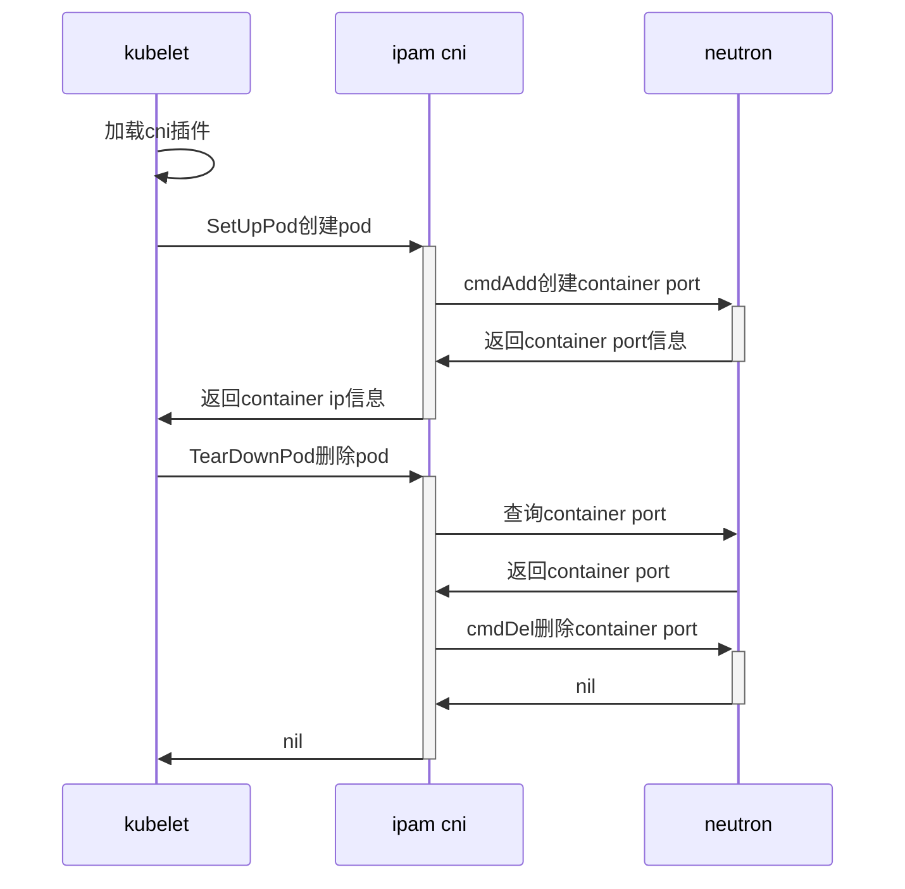

左手一个OpenStack，右手一个K8s

### 背景

有OpenStack, 又有Kubernetes; 网络想做统一管理. k8s集群运行在OpenStack VM下, 如何做到更深层面的网络打通，典型的原因有：
1. VM防arp欺骗，默认OpenStack虚拟机端口都开启了此功能；处于OpenStack VM里的k8s集群私有ip就无法扩节点通信，
通过配置neutron port的allow_address_pairs可以放行私有ip
2. Overlay网络损耗，再加上在虚拟机里部署k8s集群，又跑了一层overlay网络，网络开销又增大了；

### 可选方案

#### k8s网络使用underlay网络

对现有应用需大量改造，应用内部大量使用内部service机制来调用其它服务，不兼容旧模型，pod使用的是underlay网络，性能卓越.

#### k8s网络使用多种cni

k8s node运行ipvlan或macvlan+ptp的cni, node节点同时加载两个cni插件，ptp cni的作用是创建一对veth，
连接pod和宿主机，并设置条路由，可以实现pod也能访问k8s service. 如果是OpenStack、k8s融合场景下，考虑到
ipvlan稳定内核推荐版本是>=4.2，可以再实现一种cni，把虚拟机的网卡映射给pod.

#### 使用Kuryr-kubernetes

k8s node宿主机运行neutron-agent, 能够使用Neutron L3与Security Group来对网络进行路由，过滤访问；
node宿主机是OpenStack虚拟机的话，那就是嵌套vlan/vxlan，把网络又变复杂了. 适用于OpenStack和k8s集群是独立的环境，相当于由OpenStack接管service和
NetworkPolicy，OpenStack实现变复杂.

最终选择`k8s网络使用多种cni方案`，基于保留k8s原生特性，只需要改动k8s cni这部分. 

任务划分：
1. 基于neutron的cni ipam plugin(如果OpenStack和K8s是融合的，还需要考虑频繁更新port的ip列表)
2. ipvlan+ptp多cni运行，ptp cni实现pod与宿主机用veth连接
3. 实现一种虚拟机的网卡映射给pod的cni(OpenStack、k8s融合场景)

为什么用ipvlan？ipvlan的子接口mac地址和父网卡一样，ipvlan很符合neutron port属性，一个port可以带多个ip且mac地址相同

### cni ipam neutron

环境版本：
- Kubernetes：v1.14.6
- Etcd：3.3.12
- Docker：18.09.9
- dlv：1.4.0
- Golang：1.12.7

#### 实现
k8s v1.14.6对应github.com/containernetworking/cni版本是v0.6.0；其它k8s版本找其对应的cni版本即可，应该变化不大.

参考host-local ipam(v0.6.0)插件实现 - 使用neutron作为一个统一的ipam
```
# git clone https://github.com/containernetworking/plugins.git
```

调用流程图如下：



参考实现: [https://github.com/yaoice/cni-ipam-neutron](https://github.com/yaoice/cni-ipam-neutron)

### ipam验证测试
```
# 创建port
$ echo '{"cniVersion": "0.3.1","name": "examplenet","ipam": {"name": "myipam","type": "ipam-neutron","openstackConf": {"username": "admin","password": "c111f3c44f352e91ce76","project": "admin","domain": "default","authUrl": "http://10.125.224.21:35357/v3"},"neutronConf": {"networks": ["782ec9ac-44f9-4318-8c67-a2fed2ccca4f"]}}}' | CNI_COMMAND=ADD CNI_CONTAINERID=example CNI_NETNS=/dev/null CNI_IFNAME=dummy0 CNI_PATH=. ./cni-ipam-neutron

{
    "ips": [
        {
            "version": "4",
            "address": "203.0.113.2/24",
            "gateway": "203.0.113.1"
        }
    ],
    "dns": {}
}
```

```
# 删除port
$ echo '{"cniVersion": "0.3.1","name": "examplenet","ipam": {"name": "myipam","type": "ipam-neutron","openstackConf": {"username": "admin","password": "c111f3c44f352e91ce76","project": "admin","domain": "default","authUrl": "http://10.125.224.21:35357/v3"},"neutronConf": {"networks": ["782ec9ac-44f9-4318-8c67-a2fed2ccca4f"]}}}' | CNI_COMMAND=DEL CNI_CONTAINERID=example CNI_NETNS=/dev/null CNI_IFNAME=dummy0 CNI_PATH=. ./cni-ipam-neutron
```

### 参考链接

- [https://github.com/lyft/cni-ipvlan-vpc-k8s/blob/master/plugin/unnumbered-ptp/unnumbered-ptp.go](https://github.com/lyft/cni-ipvlan-vpc-k8s/blob/master/plugin/unnumbered-ptp/unnumbered-ptp.go)
- [kubernetes的clusterip机制调研及macvlan网络下的clusterip坑解决方案](https://zhuanlan.zhihu.com/p/67384482)
- [K8S CNI之：利⽤ ipvlan + host-local 打通容器与宿主机的平⾏⽹络](https://juejin.im/post/5c926709f265da60e86e0ca6)
- [完善cni的ipam方案](https://jeremyxu2010.github.io/2019/07/%E5%AE%8C%E5%96%84cni%E7%9A%84ipam%E6%96%B9%E6%A1%88/)
