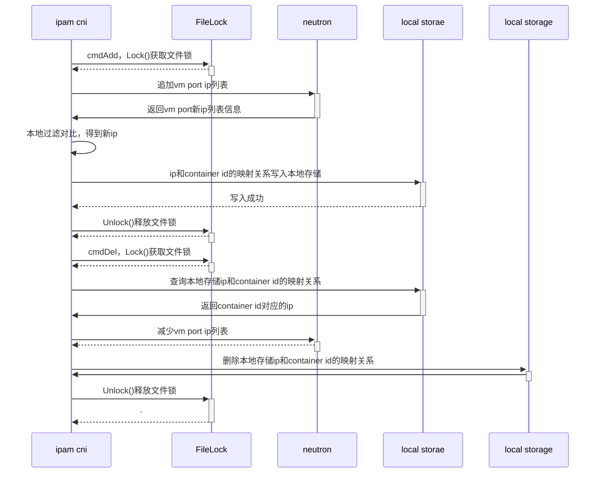

继上篇[k8s、OpenStack网络打通(一)](http://www.iceyao.com.cn/2020/05/06/k8s%E7%BD%91%E7%BB%9C%E5%BC%80%E5%8F%91-k8s-OpenStack%E7%BD%91%E7%BB%9C%E6%89%93%E9%80%9A%E4%B8%80/),
已经实现了一个neutron-ipam, 接下来就是具体cni插件实现容器添加/卸载网卡的功能.

### ipvlan模式

#### 原理 

这种模式是同时加载了两种cni插件，ipvlan和veth-host，即pod有两种网卡；一张是ipvlan的子网卡，另一张是veth网卡，veth另一端在宿主机上，与宿主机构成veth对

以下两种场景中的ipvlan工作在l2模式，实际上ipvlan是有三种模式的
- L2模式下入出流量不会经过host namespace网络，无法支持kube-proxy
- L3模式但入琉璃那个不经过host namespace网络，无法支持kube-proxy
- L3S模式下出入流量均经过host namespace的三层网络，但又会带来以下新的问题：
  - 当service的client和server POD在一个master时，server的response报文会走ipvlan datapath, service访问失败
  - L3S模式下流量从4层进入interface，无法支持kata等安全容器
  - 当client和server在同一node时，导致同一方向流量多次进出host conntrack，datapath复杂，和iptables/ipvs也存在兼容性问题

#### OpenStack与K8s独立部署场景


1. pod路由，pod内部有两条路由；一条是默认路由，下一跳地址是neutron网络的二层网关，流量从ipvlan子接口出；
另一条是目的地址是k8s service网段，流量从veth网卡出(与宿主机构成veth对)，然后再经过宿主机命名空间的iptables/ipset，这样service就可以生效了
2. 宿主机上有目的地址为pod ip的直通路由，流量从与pod构成veth对的网卡出
3. 同主机pod通信，流量通过宿主机上的直通路由(目的地址为pod ip)进行转发
4. 跨主机pod通信，pod之间处于同cidr的话，二层可达就可以；不同cidr，pod间的默认网关均指向neutron网络的二层网关地址，依靠上层物理路由转发

#### OpenStack与K8s融合部署场景


融合场景下的pod/宿主机路由，同主机/跨主机通信原理一致

cni ipam虽然已经实现了从neutron分配ip, 但是在K8s、OpenStack融合的场景下(即k8s部署在OpenStack VM中)，受制于neutron port的ip-mac绑定；
neutron port是跟VM关联的，要实现VM下的pod之间能够互相通信，就必须让cni-ipam-neutron支持这种场景，有两种方式：

1. 开启pod宿主机(即VM)的allow_address_pairs
  
    有点走偏门的感觉，在neutron那边创建的port只是占用了这个ip，避免被其它使用，实质上没有任何作用；
    配置allow_address_pairs只是让这个ip在虚拟机内部能够通行
    
2. neutron port可以绑定多个ip, 更新维护port的ip列表

    比较正规的操作，看port的ip列表就知道pod运行在哪台虚拟机下

无论是哪种方式，都要能获取到neutron port的id，然后进行port更新操作. 在虚拟机内部如何获取port id?

1. 把port信息塞到元数据服务器里

   ```
   curl http://169.254.169.254/2007-01-19/meta-data/
   ```
   需要在OpenStack层面做点开发
   
2. 通过port的ip反向查询，找出对应的port id

    通过cni配置文件可以加个变量参数hostInterface宿主机的网卡，抓取对应的IP，然后调用neutron api获得
    对应的port id. hostInterface默认值为默认网关所在的那张网卡的IP.
    
选择2这种方式获取port id后，考虑到创建和删除操作都需要对这个vm port的ip列表进行update操作；如何保证原子操作？

考虑分布式锁？分布式锁肯定可以解决问题，但结合VM的性质，一个本地文件锁就可以解决问题. 因为如果是更新同一个vm port的ip
列表的话，即创建/删除宿主机的pod，创建/删除操作都是由宿主机的ipam插件发起，也就是在同一台VM上.

go-filemutex用于多进程间的同步
```
import (
    "log"
    "github.com/alexflint/go-filemutex"
)

func main() {
    m, err := filemutex.New("/tmp/foo.lock")
    if err != nil {
        log.Fatalln("Directory did not exist or file could not created")
    }

    m.Lock()  // Will block until lock can be acquired

    // Code here is protected by the mutex

    m.Unlock()
}
```
一旦某个进程获得文件锁，未释放文件锁前其它进程在尝试获得锁的时候将会阻塞

调用neutron port-update的时候，返回的port ip列表是乱序排列的
```
neutron port-update \
    --fixed-ip subnet_id=3088e889-5a39-4e0b-81e6-90fcc71bd2fb,ip_address=192.168.53.48 \
    --fixed-ip subnet_id=3088e889-5a39-4e0b-81e6-90fcc71bd2fb,ip_address=192.168.53.81 \
    --fixed-ip subnet_id=3088e889-5a39-4e0b-81e6-90fcc71bd2fb,ip_address=192.168.53.92 \
    --fixed-ip subnet_id=3088e889-5a39-4e0b-81e6-90fcc71bd2fb e2a14f58-f6e2-4f44-b43c-03cc50e14b8b 
```
要解决ip列表乱序排列不是很困难的事，可以在neutron api那边修改或在本地获取前后两次ip列表，对比差异得到的那个ip就是pod新分配的ip地址；同时把ip和container-id的映射关系写入本地存储.

新的调用流程图：


### 网卡直通模式

弹性网卡直通模式, 基于host-device cni插件改造的host-device-plus插件+veth-host插件组成的pod双网卡模式；nova支持给vm挂载多张网卡，网卡数量受限于pci上限，
实际上CentOS 7系统单vm pci设备数量上限是32

#### 手动实践

默认docker实例被创建出来后，ip netns(从/var/run/netns读取)无法看到容器实例对应的namespace.

查找容器的主进程ID
```
# docker inspect --format '{{.State.Pid}}' <docker实例名字或ID>
# docker inspect --format '{{.State.Pid}}' ae06166543d7
```

创建/var/run/netns 目录以及符号连接 
```
# mkdir /var/run/netns
# ln -s /proc/<容器的主进程ID>/ns/net /var/run/netns/<docker实例名字或ID>
# ln -s /proc/21944/ns/net /var/run/netns/ae06166543d7
# ip netns
ae06166543d7 (id: 1)
```

进入namespace查看
```
# ip netns exec ae06166543d7 ip a
1: lo: <LOOPBACK,UP,LOWER_UP> mtu 65536 qdisc noqueue state UNKNOWN group default qlen 1000
    link/loopback 00:00:00:00:00:00 brd 00:00:00:00:00:00
    inet 127.0.0.1/8 scope host lo
       valid_lft forever preferred_lft forever
3: veth0@if26: <BROADCAST,MULTICAST,UP,LOWER_UP> mtu 1500 qdisc noqueue state UP group default 
    link/ether a2:f9:57:16:c2:6d brd ff:ff:ff:ff:ff:ff link-netnsid 0
25: eth0: <BROADCAST,MULTICAST,UP,LOWER_UP> mtu 1500 qdisc pfifo_fast state UP group default qlen 1000
    link/ether fa:16:3e:4d:76:00 brd ff:ff:ff:ff:ff:ff
    inet 192.168.52.30/24 brd 192.168.52.255 scope global eth0
       valid_lft forever preferred_lft forever
```

把宿主机网卡设备添加到namespace
```
# ip link set dev23 netns ae06166543d7
# ip netns exec ae06166543d7 ip a
1: lo: <LOOPBACK,UP,LOWER_UP> mtu 65536 qdisc noqueue state UNKNOWN group default qlen 1000
    link/loopback 00:00:00:00:00:00 brd 00:00:00:00:00:00
    inet 127.0.0.1/8 scope host lo
       valid_lft forever preferred_lft forever
3: veth0@if26: <BROADCAST,MULTICAST,UP,LOWER_UP> mtu 1500 qdisc noqueue state UP group default 
    link/ether a2:f9:57:16:c2:6d brd ff:ff:ff:ff:ff:ff link-netnsid 0
23: dev23: <BROADCAST,MULTICAST> mtu 1500 qdisc noop state DOWN group default qlen 1000
    link/ether fa:16:3e:95:e5:b5 brd ff:ff:ff:ff:ff:ff
25: eth0: <BROADCAST,MULTICAST,UP,LOWER_UP> mtu 1500 qdisc pfifo_fast state UP group default qlen 1000
    link/ether fa:16:3e:4d:76:00 brd ff:ff:ff:ff:ff:ff
    inet 192.168.52.30/24 brd 192.168.52.255 scope global eth0
       valid_lft forever preferred_lft forever
```

从namespace中移除宿主机网卡设备
```
# ip netns exec ae06166543d7 ip link set dev23 netns 1
# ip netns exec ae06166543d7 ip a
1: lo: <LOOPBACK,UP,LOWER_UP> mtu 65536 qdisc noqueue state UNKNOWN group default qlen 1000
    link/loopback 00:00:00:00:00:00 brd 00:00:00:00:00:00
    inet 127.0.0.1/8 scope host lo
       valid_lft forever preferred_lft forever
3: veth0@if26: <BROADCAST,MULTICAST,UP,LOWER_UP> mtu 1500 qdisc noqueue state UP group default 
    link/ether a2:f9:57:16:c2:6d brd ff:ff:ff:ff:ff:ff link-netnsid 0
25: eth0: <BROADCAST,MULTICAST,UP,LOWER_UP> mtu 1500 qdisc pfifo_fast state UP group default qlen 1000
    link/ether fa:16:3e:4d:76:00 brd ff:ff:ff:ff:ff:ff
    inet 192.168.52.30/24 brd 192.168.52.255 scope global eth0
       valid_lft forever preferred_lft forever
```

#### 原理

ipvlan模式使用的ipvlan有内核版本要求，采用网卡直通模式，理论上网络隔离，性能都是最佳的

```
        +---------------------------------------------------------------------------------------------------------------+
        |                                                                                                               |
        |  +----------------------------------+                       +----------------------------------+              |
        |  |            pod1                  |                       |              pod2                |              |
        |  |                                  |                       |                                  |              |
        |  |                                  |                       |                                  |              |
        |  |                                  |                       |                                  |              |
        |  |                                  |                       |                                  |              |
        |  |   +----------+    +----------+   |                       |   +----------+    +----------+   |              |
        |  |   |   eth0   |    |   veth0  |   |                       |   |   eth0   |    |   veth0  |   |              |
        |  |   | 1.1.1.6  |    |    +     |   |                       |   | 1.1.1.7  |    |    +     |   |              |
        |  |   +----------+    +----------+   |                       |   +----------+    +----------+   |              |
        |  +----------------------------------+                       +----------------------------------+              |
        |   default gw -> eth0      | service cidr -> veth0            default gw -> eth0      | service cidr -> veth0  |
        |                           |                                                          |                        |
        |                           |                                                          |                        |
        |                           |                                                          |                        |
        |                           |                                                          |                        |
        |                      +----+-----+                                               +----+-----+                  |
        |                      |   veth1  |                                               |  veth2   |                  |
        |                      |          |                                               |          |                  |
        |                      +----------+                                               +----------+                  |
        |                   +---------------------------------------------------------------------------+               |
        |                   |                         iptables/ipset/route                              |               |
        |                   +---------------------------------------------------------------------------+               |
        |                                                                                                               |
        |                                                                            宿主机路由                           |
        |                                                                           +---------------------------------+ |
        |                                                                           |                                 | |
        |                                                                           |  default via 1.1.1.254 dev eth0 | |
        |                                                                           |  1.1.1.6 dev veth1              | |
        |                                    映射给pod1             映射给pod2        |                                 | |
        |           +------------+         +------------+         +------------+    |  1.1.1.7 dev veth2              | |
        |           |            |         |            |         |            |    |                                 | |
        |           |   eth0     |         |   eth1     |         |   eth2     |    +---------------------------------+ |
        |           |  1.1.1.2   |         |            |         |            |                                        |
        |  VM       +------------+         +------------+         +------------+                                        |
        +---------------------------------------------------------------------------------------------------------------+
                         |                       |                       |
                         |                       |                       |
                         |                       |                       |
        +----------------+-----------------------+-----------------------+----------------------------------------------+
Neutron |                                          vpc cidr: 1.1.1.0/24                                                 |
        +---------------------------------------------------------------------------------------------------------------+

```
VM绑定了三张网卡，分别为eth0,eth1,eth2; eth1映射给pod1；
使用网卡直通模式时，cni-ipam-neutron需要支持和OpenStack nova联动，为VM添加新的网卡；然后host-device-plus插件自动把宿主机的网卡映射给pod，其它跟上面ipvlan模式一致

### veth路由模式

ipvlan模式有内核版本要求，网卡直通模式有pci设备数量限制要求，有没一种通用的模式呢？ 
有的，veth路由模式，流量通过宿主机上的路由和vrouter内部的路由进行转发.

#### 手动实践

容器的地址是neutron port的多IP中的IP，必须有vrouter存在；
容器发送出去的包通过VM的网卡出，回来的包需要在vrouter和宿主机设置静态路由

```
(10.10.10.8)vm -> vrouter(10.10.10.1)
           /  \
          /    \
         /      \
       容器      容器
(10.10.10.19)   (10.10.10.20) 
```
虚拟机vm ip为10.10.10.8，默认网关指向的vrouter地址是10.10.10.1

容器与宿主机通过veth对和路由进行通信
```
ip netns add test
CNI_PATH=/opt/cni/bin NETCONFPATH=/etc/cni/net.d /usr/local/bin/cnitool add cni0 /var/run/netns/test

[root@test-tcnp ~]# ip netns exec test ip a
1: lo: <LOOPBACK> mtu 65536 qdisc noop state DOWN group default qlen 1000
    link/loopback 00:00:00:00:00:00 brd 00:00:00:00:00:00
3: eth0@if46: <BROADCAST,MULTICAST,UP,LOWER_UP> mtu 1500 qdisc noqueue state UP group default 
    link/ether 72:96:91:d4:58:36 brd ff:ff:ff:ff:ff:ff link-netnsid 0
    inet 10.10.10.19/24 scope global eth0
       valid_lft forever preferred_lft forever
    inet6 fe80::7096:91ff:fed4:5836/64 scope link 
       valid_lft forever preferred_lft forever

[root@test-tcnp ~]# ip netns exec test ip route
default via 169.254.1.1 dev eth0 
169.254.1.1 dev eth0 scope link 
```
eth0与宿主机 id为46的网卡构成veth对，在命名空间里默认网关指向169.254.1.1(宿主机dummy网卡)

宿主机的veth网卡和路由
```
4: dummy0: <BROADCAST,NOARP,UP,LOWER_UP> mtu 1500 qdisc noqueue state UNKNOWN group default qlen 1000
    link/ether f2:37:21:fc:93:8d brd ff:ff:ff:ff:ff:ff
    inet 169.254.1.1/32 scope global dummy0
       valid_lft forever preferred_lft forever
    inet6 fe80::f037:21ff:fefc:938d/64 scope link 
       valid_lft forever preferred_lft forever

46: veth7c1b453d@if3: <BROADCAST,MULTICAST,UP,LOWER_UP> mtu 1500 qdisc noqueue state UP group default 
    link/ether 0e:12:32:5b:a7:f9 brd ff:ff:ff:ff:ff:ff link-netnsid 18
    inet6 fe80::c12:32ff:fe5b:a7f9/64 scope link 
       valid_lft forever preferred_lft forever
```
和容器的eth0网卡构成veth对，通过id和@if3可以看出来

宿主机到容器的路由
```
[root@test-tcnp ~]# ip route
default via 10.10.10.1 dev eth0 
10.10.10.0/24 dev eth0 proto kernel scope link src 10.10.10.8 
10.10.10.19 dev veth7c1b453d
```
路由scope采用global(默认不显示)

```
SCOPE := [ host | link | global | NUMBER ]
```
- Global: 可以转发，例如从一个端口收到的包，可以查询global的路由条目，如果目的地址在另外一个网卡，那么该路由条目可以匹配转发的要求，进行路由转发
- Link: scope路由条目是不会转发任何匹配的数据包到其他的硬件网口的，link是在链路上才有效，这个链路是指同一个端口，也就是说接收和发送都是走的同一个端口的时候，这条路由才会生效（也就是说在同一个二层）
- Host: 表示这是一条本地路由，典型的是回环端口，loopback设备使用这种路由条目，该路由条目比link类型的还要严格，约定了都是本机内部的转发，不可能转发到外部
- NUMBER: ipv6专用的路由scope

vrouter的内部路由
```
[root@ ~]# ip a
1: lo: <LOOPBACK,UP,LOWER_UP> mtu 65536 qdisc noqueue state UNKNOWN group default qlen 1000
    link/loopback 00:00:00:00:00:00 brd 00:00:00:00:00:00
    inet 127.0.0.1/8 scope host lo
       valid_lft forever preferred_lft forever
    inet6 ::1/128 scope host 
       valid_lft forever preferred_lft forever
29: qr-6382d00a-11: <BROADCAST,MULTICAST,UP,LOWER_UP> mtu 1450 qdisc noqueue state UNKNOWN group default qlen 1000
    link/ether fa:16:3e:08:c0:4d brd ff:ff:ff:ff:ff:ff
    inet 10.10.10.1/24 brd 10.10.10.255 scope global qr-6382d00a-11
       valid_lft forever preferred_lft forever
    inet6 fe80::f816:3eff:fe08:c04d/64 scope link 
       valid_lft forever preferred_lft forever
94: qg-5560d7d3-dc: <BROADCAST,MULTICAST,UP,LOWER_UP> mtu 1500 qdisc noqueue state UNKNOWN group default qlen 1000
    link/ether fa:16:3e:35:9a:a6 brd ff:ff:ff:ff:ff:ff
    ......

[root@ ~]# ip route
default via 10.125.224.1 dev qg-5560d7d3-dc 
10.10.10.0/24 dev qr-6382d00a-11 proto kernel scope link src 10.10.10.1 
10.10.10.19 via 10.10.10.8 dev qr-6382d00a-11 
10.125.224.0/26 dev qg-5560d7d3-dc proto kernel scope link src 10.125.224.34 
```
一个vrouter实际上就是一个namespace，告诉vrouter，到容器地址10.10.10.19路由的下一跳是其宿主机地址10.10.10.8; 调用neutron接口可以往vrouter里注入静态路由,
还可以绑定浮动ip直接映射到10.10.10.19(因为这也是neutron port多IP的合法IP)

销毁容器
```
CNI_PATH=/opt/cni/bin NETCONFPATH=/etc/cni/net.d /usr/local/bin/cnitool del cni0 /var/run/netns/test
ip netns del test
```

限制：vrouter的静态路由默认最大是30条
```
The number of routes exceeds the maximum 30.", "type": "RoutesExhausted", "detail": ""}}
```

#### 原理

```
            
                +------------------------------+                       +----------------------------------+
                |        pod1                  |                       |              pod2                |
                |                              |                       |                                  |
                |                              |                       |                                  |
                |                              |                       |                                  |
                |                              |                       |                                  |
                |               +----------+   |                       |  +----------+                    |
                |               |   eth0   |   |                       |  |   eth0   |                    |
                |               | 1.1.1.6  |   |                       |  | 1.1.1.7  |                    |
                |               +----------+   |                       |  +----------+                    |
                +------------------------------+                       +----------------------------------+
                                     |                                         |
pod路由：                             |                                         |   pod路由：
default via 169.254.1.1 dev eth0     |                                         |   default via 169.254.1.1 dev eth0
169.254.1.1 dev eth0 scope link      |                                         |   169.254.1.1 dev eth0 scope link
                                     |                                         |
                                +----+-----+                              +----+-----+
                                |   veth1  |                              |  veth2   |
                                |          |                              |          |
                                +----------+                              +----------+
                       +---------------------------------------------------------------------------+
                       |             |           iptables/ipset/route           |                  |
                       +---------------------------------------------------------------------------+
                                     |                                          |
                                     |               +------------+             |
                                     |               |            |             |
                                     +---------------+   dummy0   +-------------+
                                                     | 169.254.1.1|
                                                     +------------+
                                                                         宿主机路由
                                                     +------------+     +--------------------------------+
                                                     |            |     | default via 1.1.1.1 dev eth0   |
       vrouter路由                                    |   eth0     | <---+ 1.1.1.6 dev veth1              |
       +-------------------------------------+       |  1.1.1.2   |     |                                |
       | default via xxx.xxx.xxx.1 dev qg+xxx|       +-----+------+     | 1.1.1.7 dev veth2              |
       | 1.1.1.6 via 1.1.1.2 dev qr+xxx      |             |            |                                |
       | 1.1.1.7 via 1.1.1.2 dev qr+xxx      |             |            +--------------------------------+
       |                                     |             |
       +-------------------------------------+------+      |
                                                    |      |
                                                    |      | 1.1.1.1                      xxx.xxx.xxx.1
             +----------------------+             +-+------+--------+                     +-------------+
             |                      |   更新路由    |                 |xxx.xxx.xxx.24       |             |
             | veth+route+controller+-----------> |     vrouter     +---------------------+  Internet   |
             |                      |             |                 |                     |             |
             +----------^-----------+             +-----------------+                     +-------------+
                        |
                        | 监听pod事件
                        |
              +--------------------+
              |         +          |
              |   kube+apiserver   |
              |                    |
              +--------------------+

```

1. pod路由，只有一张网卡，只有一条默认网关路由，下一跳地址为169.254.1.1(宿主机的dummy0设备)
2. 宿主机上有目的地址为pod ip的直通路由，流量从与pod构成veth对的网卡出
3. 同主机pod通信，流量通过宿主机上的直通路由(目的地址为pod ip)进行转发
4. 跨主机pod通信，pod之间处于同cidr的话，pod间的默认网关均指向169.254.1.1, 流量经过宿主机的路由, 到达vrouter命名空间，再经过vrouter内部的静态路由，
到达对应的pod的宿主机，再由pod宿主机上的pod地址直通路由到达pod; 不同cidr的话，流量走的过程差不多，只是在vrouter内部，多了一条跨网段的路由转发.
5. pod要访问Internet的话，通过vrouter的默认网关出去；外部要访问pod的话，可通过绑定浮动IP映射到对应的pod IP上，浮动IP作用在vrouter命名空间内部.

cni-ipam-neutron无需做改动，还是基于neutron port多辅助IP来实现；vrouter内部到达pod地址的静态路由可以通过veth-route-controller来自动化更新


### 参考链接

- [https://kubernetes.io/docs/concepts/architecture/cloud-controller/#service-controller](https://kubernetes.io/docs/concepts/architecture/cloud-controller/#service-controller)
- [Kubernetes网络的IPVlan方案](https://kernel.taobao.org/2019/11/ipvlan-for-kubernete-net/)


