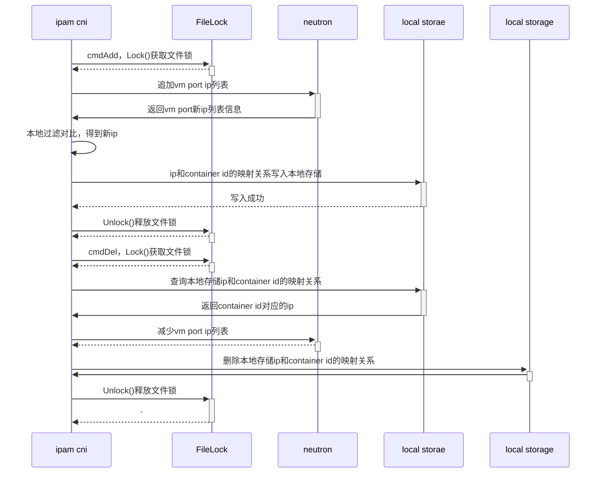

继上篇[k8s、OpenStack网络打通(一)](http://www.iceyao.com.cn/2020/05/06/%E5%A5%BD%E8%AE%B0%E6%80%A7%E4%B8%8D%E5%A6%82%E7%83%82%E7%AC%94%E5%A4%B4-k8s-OpenStack%E7%BD%91%E7%BB%9C%E6%89%93%E9%80%9A%E4%B8%80/) 
cni ipam已经实现了从neutron分配ip, 如果是在K8s、OpenStack融合的场景下(即k8s部署在OpenStack VM中)，neutron port是跟VM关联的，要想VM下的pod
能够通信，有两种方式：

1. 开启pod宿主机(即VM)的allow_address_pairs
  
    有点走偏门的感觉，在neutron那边创建的port只是占用了这个ip，避免被其它使用，实质上没有任何作用；
    配置allow_address_pairs只是让这个ip在虚拟机内部能够通行
    
2. neutron port可以绑定多个ip, 更新维护port的ip列表

    比较正规的操作，看port的ip列表就知道pod运行在哪台虚拟机下

无论是哪种方式，都要能获取到neutron port的id，然后进行port更新操作. 在虚拟机内部如何获取port id?

1. 把port信息塞到元数据服务器里

   ```
   curl http://169.254.169.254/2007-01-19/meta-data/
   ```
   需要在OpenStack层面做点开发
   
2. 通过port的ip反向查询，找出对应的port id

    通过cni配置文件可以加个变量参数hostInterface宿主机的网卡，抓取对应的IP，然后调用neutron api获得
    对应的port id. hostInterface默认值为默认网关所在的那张网卡的IP.
    

选择2这种方式获取port id后，考虑到创建和删除操作都需要对这个vm port的ip列表进行update操作；如何保证原子操作？

考虑分布式锁？分布式锁肯定可以解决问题，但结合VM的性质，一个本地文件锁就可以解决问题. 因为如果是更新同一个vm port的ip
列表的话，即创建/删除宿主机的pod，创建/删除操作都是由宿主机的ipam插件发起，也就是在同一台VM上.

go-filemutex用于多进程间的同步
```
import (
	"log"
	"github.com/alexflint/go-filemutex"
)

func main() {
	m, err := filemutex.New("/tmp/foo.lock")
	if err != nil {
		log.Fatalln("Directory did not exist or file could not created")
	}

	m.Lock()  // Will block until lock can be acquired

	// Code here is protected by the mutex

	m.Unlock()
}
```
一旦某个进程获得文件锁，未释放文件锁前其它进程在尝试获得锁的时候将会阻塞

调用neutron port-update的时候，返回的port ip列表是乱序排列的
```
neutron port-update \
    --fixed-ip subnet_id=3088e889-5a39-4e0b-81e6-90fcc71bd2fb,ip_address=192.168.53.48 \
    --fixed-ip subnet_id=3088e889-5a39-4e0b-81e6-90fcc71bd2fb,ip_address=192.168.53.81 \
    --fixed-ip subnet_id=3088e889-5a39-4e0b-81e6-90fcc71bd2fb,ip_address=192.168.53.92 \
    --fixed-ip subnet_id=3088e889-5a39-4e0b-81e6-90fcc71bd2fb e2a14f58-f6e2-4f44-b43c-03cc50e14b8b 
```
要解决ip列表乱序排列不是很困难的事，可以在neutron api那边修改或在本地获取前后两次ip列表，对比差异得到的那个ip就是pod新分配的ip地址；同时把ip和container-id的映射关系写入本地存储.

新的调用流程图：



