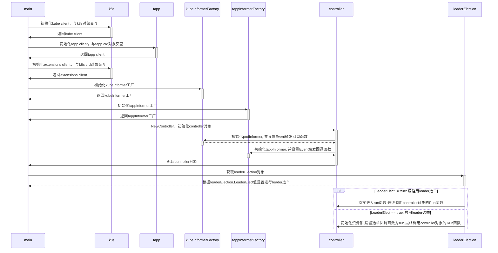

## TAPP

### 1 TAPP是什么

>TAPP是一种新的k8s应用负载，基于CRD实现，它同时包含kubernetes`deployment`和`statefulset`的大多数特性， 
>并且用户可以轻松在Kubernetes上运行遗留应用程序。当前许多用户希望采用Kubernetes，并将其旧版应用程序迁移到Kubernetes。
>但是他们不能直接使用Kubernetes的工作负载（例如，`deployment`，`statefulset`），因此将这些应用程序转换为微服务将需要大量的努力。
>Tapp可以解决这些问题。

### 2 TAPP特性

- 支持每个pod的唯一索引，(与`statefulset`相同)
  
- 支持在特定实例(pod)上执行启动/停止/升级操作
  
     它更适合传统的操作和维护，例如当管理员想要停止一台计算机时，他可以停止该计算机上的实例，而不会影响其他计算机上的实例。
  
- 支持实例的就地更新
  
     尽管许多无状态工作负载可以容忍非就地更新，但不排除某些应用很敏感，毕竟Pod重新启动是一种比较极端的方式，导致较低的可用性或较高的运行成本。

- 支持多种版本的实例

     实例使用不同的镜像或不同的配置。

- 支持HPA，根据多种指标（例如CPU，内存，自定义指标）

- 支持滚动更新，回滚

### 3 TAPP使用

#### 3.1 编译tapp-controller

```
~/go_workspace/src/tkestack.io/tapp# make build
hack/build.sh
Build success!
```

命令行运行tapp-controller
```
root@xiabingyao-LC0:~/go_workspace/src/tkestack.io/tapp# bin/tapp-controller --kubeconfig=/root/.kube/config
I0121 15:07:41.615902 3726361 controller.go:155] Setting up event handlers
I0121 15:07:41.644437 3726361 controller.go:196] Starting tapp controller
I0121 15:07:41.644466 3726361 controller.go:199] Waiting for informer caches to sync
E0121 15:07:41.646686 3726361 reflector.go:126] pkg/mod/k8s.io/client-go@v11.0.1-0.20191029005444-8e4128053008+incompatible/tools/cache/reflector.go:94: Failed to list *v1.TApp: the server could not find the requested resource (get tapps.apps.tkestack.io)
I0121 15:07:42.744715 3726361 controller.go:204] Starting workers
I0121 15:07:42.744775 3726361 controller.go:210] Started workers
```
创建tapp crd的过程也定义在tapp-controller代码中，一启动自动创建好了

#### 3.2 创建tapp对象 

#### 3.2.1 使用同样的template

创建example-tapp tapp cr
```
kubectl apply -f - << EOF
apiVersion: apps.tkestack.io/v1
kind: TApp
metadata:
  name: example-tapp
  namespace: test
spec:
  replicas: 3
  template:
    metadata:
      labels:
        app: example-tapp
    spec:
      containers:
      - name: nginx
        image: nginx:1.7.9
EOF
```

#### 3.2.2 使用不一样的template

```
kubectl apply -f - << EOF
apiVersion: apps.tkestack.io/v1
kind: TApp
metadata:
  name: example-tapp
  namespace: test
spec:
  replicas: 3
  template:
    metadata:
      labels:
        app: example-tapp
    spec:
      containers:
      - name: nginx
        image: nginx:1.8.1
  templatePool:
    "test":
      metadata:
        labels:
          app: example-tapp
      spec:
        containers:
        - name: nginx
          image: nginx:1.7.9
  templates:
    "1": "test"
#  defaultTemplateName: "test"
EOF
```
tapp新增了多个字段以支持更多的特性，`spec.templatePools`、`spec.templates`和`defaultTemplateName`
- `spec.templatePools`来声明template
- `spec.templates`指定pod使用哪个template，如果没指定，默认使用default template
- 在`spec.templatePools`中使用`spec.DefaultTemplateName`来设置default template，
  如果未设置的话，`spec.template`作为default template.
  
#### 3.3 查询tapp对象 

查看tapp资源列表
```
~/go_workspace/src/tkestack.io/tapp# kubectl -n test get tapps.apps.tkestack.io 
NAME           AGE
example-tapp   72s
```

查看tapp资源描述
```
~/go_workspace/src/tkestack.io/tapp# kubectl descirbe tapp tapps.apps.tkestack.io example-tapp
```

查看pod
```
~/go_workspace/src/tkestack.io/tapp# kubectl -n test get pod 
NAME             READY   STATUS    RESTARTS   AGE
example-tapp-0   1/1     Running   0          73s
example-tapp-1   1/1     Running   0          73s
example-tapp-2   1/1     Running   0          73s
```

#### 3.4 更新tapp对象

如果仅更新容器的映像，则Tapp控制器将对Pod进行就地更新，否则它将删除Pod并重新创建它们.

#### 3.4.1 更新特定的pod

```
kubectl apply -f - << EOF
apiVersion: apps.tkestack.io/v1
kind: TApp
metadata:
  name: example-tapp
  namespace: test
spec:
  replicas: 3
  template:
    metadata:
      labels:
        app: example-tapp
    spec:
      containers:
      - name: nginx
        image: nginx:latest
  templatePool:
    "test2":
      metadata:
        labels:
          app: example-tapp
      spec:
        containers:
        - name: nginx
          image: nginx:1.8.1
  templates:
     "1": "test2"
EOF
```
指定pod-xxx-1使用test2的`spec.templatePool`, pod是并发更新的

#### 3.4.2 滚动更新

```
kubectl apply -f - << EOF
apiVersion: apps.tkestack.io/v1
kind: TApp
metadata:
  name: example-tapp
  namespace: test
spec:
  replicas: 3
  template:
    metadata:
      labels:
        app: example-tapp
    spec:
      containers:
      - name: nginx
        image: nginx:latest
  templatePool:
    "test2":
      metadata:
        labels:
          app: example-tapp
      spec:
        containers:
        - name: nginx
          image: nginx:1.7.9
  templates:
    "1": "test2"
    "2": "test2"
  updateStrategy:
    template: test2
    maxUnavailable: 1
EOF
```
- 使用`spec.updateStrategy`指定滚动更新template
- 使用`spec.updateStrategy.maxUnavailable`指定更新过程中最大可容忍不可用的pod数量，可以是整数或百分比;
  默认值为1

#### 3.5 杀死特定pod

```
kubectl apply -f - << EOF
apiVersion: apps.tkestack.io/v1
kind: TApp
metadata:
  name: example-tapp
  namespace: test
spec:
  replicas: 3
  template:
    metadata:
      labels:
        app: example-tapp
    spec:
      containers:
      - name: nginx
        image: nginx:latest
  templatePool:
    "test2":
      metadata:
        labels:
          app: example-tapp
      spec:
        containers:
        - name: nginx
          image: nginx:1.7.9
  templates:
    "1": "test2"
  statuses:
    "1": "Killed"
EOF
```
使用`spec.statuses`可以指定pod的状态，上面例子指定pod-xxx-1被tapp controller kill掉；如果想再次运行pod-xxx-1，移除`spec.statuses`即可

#### 3.6 扩缩容tapp

使用什么样的template，跟上面【创建tapp对象】【使用不一样的template】章节方式一致，`kubectl scale`命令同样适用于
tapp
```
~/go_workspace/src/tkestack.io/tapp# kubectl -n test scale --replicas=4 tapps.apps.tkestack.io example-tapp
```

#### 3.7 Headless service

Tapp支持statefulset headless service方式，每个pod的subdomain: $(podname).$(namespace).svc.cluster.local, 
如cluster domain是"cluster.local"
```
kubectl apply -f - << EOF
 apiVersion: v1
  kind: Service
  metadata:
    name: nginx
    namespace: test
    labels:
      app: example-tapp
  spec:
    ports:
    - port: 80
      name: web
    clusterIP: None
    selector:
      app: example-tapp
---
  apiVersion: apps.tkestack.io/v1
  kind: TApp
  metadata:
    name: example-tapp
    namespace: test
  spec:
    replicas: 3
    serviceName: "nginx"
    template:
      metadata:
        labels:
          app: example-tapp
      spec:
        containers:
        - name: nginx
          image: nginx:1.7.9
EOF
```

#### 3.8 删除unused template

通过设置`spec.autoDeleteUnusedTemplate`为true，可以删除未被使用的template，来使tapp对象内容更简洁
```
kubectl apply -f - << EOF
  apiVersion: apps.tkestack.io/v1
  kind: TApp
  metadata:
    name: example-tapp
    namespace: test
  spec:
    replicas: 3
    autoDeleteUnusedTemplate: true
    template:
      metadata:
        labels:
          app: example-tapp
      spec:
        containers:
        - name: nginx
          image: nginx:1.7.9
    templatePool:
      "test1":
        metadata:
          labels:
            app: example-tapp
        spec:
          containers:
          - name: nginx
            image: nginx:1.7.9
      "test2":
        metadata:
          labels:
            app: example-tapp
        spec:
          containers:
          - name: nginx
            image: nginx:1.7.8
      "test3":
        metadata:
          labels:
            app: example-tapp
        spec:
          containers:
          - name: nginx
            image: nginx:1.7.7
      "test4":
        metadata:
          labels:
            app: example-tapp
        spec:
          containers:
          - name: nginx
            image: nginx:1.7.7
    templates:
      "1": "test1"
    updateStrategy:
      template: "test3"
      maxUnavailable: 1
    DefaultTemplateName: "test4"
EOF
```

#### 3.9 tapp with volume

```
kubectl apply -f - << EOF
apiVersion: apps.tkestack.io/v1
kind: TApp
metadata:
  name: example-tapp
  namespace: test
spec:
  replicas: 2
  template:
    metadata:
      labels:
        app: example-tapp
    spec:
      containers:
      - name: nginx
        image: nginx:1.7.9
        volumeMounts:
        - name: www
          mountPath: /usr/share/nginx/html
  volumeClaimTemplates:
  - metadata:
      name: www
      labels:
        app: example-tapp
    spec:
      accessModes: [ "ReadWriteOnce" ]
      storageClassName: rbd
      resources:
        requests:
          storage: 10Gi
EOF          
```

#### 3.10 删除tapp

```
# kubectl -n test delete tapps.apps.tkestack.io example-tapp
```

#### 3.11 清理tapp

```
# kubectl delete crd tapps.apps.tkestack.io
```

### 4 代码分析

#### 4.1 结构体

#### 4.1.1 TApp
```
// TApp represents a set of pods with consistent identities.
type TApp struct {
    metav1.TypeMeta   `json:",inline"`
    metav1.ObjectMeta `json:"metadata,omitempty"`

    // Spec defines the desired identities of pods in this tapp.
    Spec TAppSpec `json:"spec,omitempty"`

    // Status is the current status of pods in this TApp. This data
    // may be out of date by some window of time.
    Status TAppStatus `json:"status,omitempty"`
}
```

#### 4.1.2 TAppSpec
```
// A TAppSpec is the specification of a TApp.
type TAppSpec struct {
    // Replicas is the desired number of replicas of the given Template.
    // These are replicas in the sense that they are instantiations of the
    // same Template, but individual replicas also have a consistent identity.
    Replicas int32 `json:"replicas"`

    // Selector is a label query over pods that should match the replica count.
    // If empty, defaulted to labels on the pod template.
    // More info: http://releases.k8s.io/release-1.4/docs/user-guide/labels.md#label-selectors
    Selector *metav1.LabelSelector `json:"selector,omitempty"`

    // Template is the object that describes the pod that will be initial created/default scaled
    // it should be added to TemplatePool
    Template corev1.PodTemplateSpec `json:"template"`

    // TemplatePool stores a map whose key is template name and value is podTemplate
    TemplatePool map[string]corev1.PodTemplateSpec `json:"templatePool,omitempty"`

    // Statuses stores desired instance status instanceID --> desiredStatus
    Statuses map[string]InstanceStatus `json:"statuses,omitempty"`

    // Templates stores instanceID --> template name
    Templates map[string]string `json:"templates,omitempty"`

    // UpdateStrategy indicates the TappUpdateStrategy that will be
    // employed to update Pods in the TApp
    UpdateStrategy TAppUpdateStrategy `json:"updateStrategy,omitempty"`

    // ForceDeletePod indicates whether force delete pods when it is being deleted because of NodeLost.
    // Default values is false.
    ForceDeletePod bool `json:"forceDeletePod,omitempty"`

    // AutoDeleteUnusedTemplate indicates whether auto delete templates when it is unused.
    // Default values is false.
    AutoDeleteUnusedTemplate bool `json:"autoDeleteUnusedTemplate,omitempty"`

    // NeverMigrate indicates whether to migrate pods. If it is true, pods will never be migrated to
    // other nodes, otherwise it depends on other conditions(e.g. pod restart policy).
    NeverMigrate bool `json:"neverMigrate,omitempty"`

    // volumeClaimTemplates is a list of claims that pods are allowed to reference.
    // The StatefulSet controller is responsible for mapping network identities to
    // claims in a way that maintains the identity of a pod. Every claim in
    // this list must have at least one matching (by name) volumeMount in one
    // container in the template. A claim in this list takes precedence over
    // any volumes in the template, with the same name.
    // TODO: Define the behavior if a claim already exists with the same name.
    VolumeClaimTemplates []corev1.PersistentVolumeClaim `json:"volumeClaimTemplates,omitempty"`

    // ServiceName is the name of the service that governs this TApp.
    // This service must exist before the TApp, and is responsible for
    // the network identity of the set. Pods get DNS/hostnames that follow the
    // pattern: pod-specific-string.serviceName.default.svc.cluster.local
    // where "pod-specific-string" is managed by the TApp controller.
    ServiceName string `json:"serviceName,omitempty"`

    //DefaultTemplateName is the default template name for scale
    DefaultTemplateName string `json:"defaultTemplateName"`
}
```

#### 4.1.3 TAppUpdateStrategy
```
// TApp update strategy
type TAppUpdateStrategy struct {
    // Following fields are rolling update related configuration.
    // Template is the rolling update template name
    Template string `json:"template,omitempty"`
    // MaxUnavailable is the max unavailable number when tapp is rolling update, default is 1.
    MaxUnavailable *intstr.IntOrString `json:"maxUnavailable,omitempty"`

    // Following fields are force update related configuration.
    ForceUpdate ForceUpdateStrategy `json:"forceUpdate,omitempty"`
}
```

#### 4.1.4 ForceUpdateStrategy
```
type ForceUpdateStrategy struct {
    // MaxUnavailable is the max unavailable number when tapp is forced update, default is 100%.
    MaxUnavailable *intstr.IntOrString `json:"maxUnavailable,omitempty"`
}
```

#### 4.1.5 InstanceStatus

```
type InstanceStatus string

const (
    InstanceNotCreated InstanceStatus = "NotCreated"
    InstancePending    InstanceStatus = "Pending"
    InstanceRunning    InstanceStatus = "Running"
    InstanceUpdating   InstanceStatus = "Updating"
    InstancePodFailed  InstanceStatus = "PodFailed"
    InstancePodSucc    InstanceStatus = "PodSucc"
    InstanceKilling    InstanceStatus = "Killing"
    InstanceKilled     InstanceStatus = "Killed"
    InstanceFailed     InstanceStatus = "Failed"
    InstanceSucc       InstanceStatus = "Succ"
    InstanceUnknown    InstanceStatus = "Unknown"
)
```

#### 4.1.6 TAppStatus
```
type AppStatus string

const (
    AppPending AppStatus = "Pending"
    AppRunning AppStatus = "Running"
    AppFailed  AppStatus = "Failed"
    AppSucc    AppStatus = "Succ"
    AppKilled  AppStatus = "Killed"
)

// TAppStatus represents the current state of a TApp.
type TAppStatus struct {
    // most recent generation observed by controller.
    ObservedGeneration int64 `json:"observedGeneration,omitempty"`

    // Replicas is the number of actual replicas.
    Replicas int32 `json:"replicas"`

    // ReadyReplicas is the number of running replicas
    ReadyReplicas int32 `json:"readyReplicas"`

    // ScaleSelector is a label for query over pods that should match the replica count used by HPA.
    ScaleLabelSelector string `json:"scaleLabelSelector,omitempty"`

    // AppStatus describe the current TApp state
    AppStatus AppStatus `json:"appStatus,omitempty"`

    // Statues stores actual instanceID --> InstanceStatus
    Statuses map[string]InstanceStatus `json:"statuses,omitempty"`
}
```

#### 4.1.7 TAppList
```
// TAppList is a collection of TApp.
type TAppList struct {
    metav1.TypeMeta `json:",inline"`
    metav1.ListMeta `json:"metadata,omitempty"`
    Items           []TApp `json:"items"`
}
```

#### 4.1.8 Instance
```
// instance is the control block used to transmit all updates about a single instance.
// It serves as the manifest for a single instance. Users must populate the pod
// and parent fields to pass it around safely.
type Instance struct {
    // pod is the desired pod.
    pod *corev1.Pod
    // id is the identity index of this instance.
    id string
    // parent is a pointer to the parent tapp.
    parent *tappv1.TApp
}
```

#### 4.2 核心逻辑

#### 4.2.1 主函数

主函数流程图：


#### 4.2.2 Sync函数

main函数最终调用的是run函数，run函数调用流程：
```
run -> controller.Run -> c.runWorker -> controller.Sync
```

```
    run := func(ctx context.Context) {
        stop := ctx.Done()
        //createCRD默认为true，tapp控制器启动时自动创建tapp crd，如果存在则更新
        if createCRD {
            wait.PollImmediateUntil(time.Second*5, func() (bool, error) { return tapp.EnsureCRDCreated(extensionsClient) }, stop)
        }
        //registerAdmission默认为false，是否注册一个ValidatingWebhook，用于校验tapp对象的合法性
        if registerAdmission {
            wait.PollImmediateUntil(time.Second*5, func() (bool, error) {
                return admission.Register(kubeClient, namespace, tlsCAfile)
            }, stop)
            server, err := admission.NewServer(listenAddress, tlsCertFile, tlsKeyFile)
            if err != nil {
                klog.Fatalf("Error new admission server: %v", err)
            }
            go server.Run(stop)
        }
        //运行所有🕐已注册的kubeInformer
        //Start函数已经是非阻塞，在一个独立的goroutine启动所有已注册informer, 无需`go kubeInformerFactory.Start`
        go kubeInformerFactory.Start(stop)
         //运行所有🕐已注册的tappInformer
        go tappInformerFactory.Start(stop)
        //设置deletePodAfterAppFinish变量，默认为true
        tapp.SetDeletePodAfterAppFinish(deletePodAfterAppFinish)
        //
        if err = controller.Run(worker, stop); err != nil {
            klog.Fatalf("Error running controller: %s", err.Error())
        }
    }
```

```
// worker runs a worker thread that just dequeues items, processes them, and marks them done.
// It enforces that the syncHandler is never invoked concurrently with the same key.
func (c *Controller) runWorker() {
    for {
        func() {
            key, quit := c.workqueue.Get()
            if quit {
                return
            }
            defer c.workqueue.Done(key)
            if err := c.syncHandler(key.(string)); err != nil {
                klog.Errorf("Error syncing TApp %v, re-queuing: %v", key.(string), err)
                c.workqueue.AddRateLimited(key)
            } else {
                c.workqueue.Forget(key)
            }
        }()
    }
}
```
核心处理函数是`c.syncHandler`，而`controller.syncHandler = controller.Sync`

```
// Sync syncs the given tapp.
func (c *Controller) Sync(key string) error {
    startTime := time.Now()
    defer func() {
        klog.V(4).Infof("Finished syncing tapp %s(%v)", key, time.Now().Sub(startTime))
    }()

    //controller.podStoreSynced = podInformer.Informer().HasSynced
    if !c.podStoreSynced() {
        klog.V(2).Infof("Pod store is not synced, skip syncing tapp %s", key)
        // Sleep to give the pod reflector goroutine a chance to run.
        time.Sleep(PodStoreSyncedPollPeriod)
        return fmt.Errorf("waiting for pods controller to sync")
    }

    namespace, name, err := cache.SplitMetaNamespaceKey(key)
    if err != nil {
        return err
    }
    tapp, err := c.tappLister.TApps(namespace).Get(name)
    if errors.IsNotFound(err) {
        klog.Infof("TApp has been deleted %v", key)
        return nil
    }
    if err != nil {
        klog.Errorf("Unable to retrieve tapp %s from store: %v", util.GetTAppFullName(tapp), err)
        return err
    }
    //1. 为tapp对象设置默认值
    //2. 根据tapp.Spec.AutoDeleteUnusedTemplate开关，是否移除未被使用的template
    //3. 为tapp设置labelSelector
    //4. 为tapp设置scaleLabelSelector
    //5. reflect反射对比前后tapp的Spec内容，有差异则更新tapp
    //6. reflect反射对比前后tapp的Status内容，有差异则更新tapp Status
    err = c.preprocessTApp(tapp)
    if err != nil {
        klog.Errorf("Failed to preprocess tapp %s: %v", util.GetTAppFullName(tapp), err)
        return err
    }
    //1. 获取tapp的labelSelector
    //2. 根据labelSelector过滤pod列表并返回
    pods, err := c.getPodsForTApp(tapp)
    if err != nil {
        klog.Errorf("Failed to get pods for tapp %s: %v", util.GetTAppFullName(tapp), err)
        return err
    }
    //Tapp finish判断依据：tapp状态处于Failed或Succ或Killed
    if isTAppFinished(tapp) && tapp.Generation == tapp.Status.ObservedGeneration &&
        tapp.Spec.Replicas == tapp.Status.Replicas && len(pods) == 0 {
        klog.Errorf("Tapp %s has finished, replica: %d, status: %s", util.GetTAppFullName(tapp),
            tapp.Spec.Replicas, tapp.Status.AppStatus)
        return nil
    }
    //同步tapp分为三个环节：
    //1. 计算出要添加/删除/强制删除/更新的instance，instance~=pod，多了parent父指针指向tapp和id
    //2. 同步pod的Conditions
    //3. 同步instances
    c.syncTApp(tapp, pods)
    //更新tapp的status字段
    if err := c.updateTAppStatus(tapp, pods); err != nil {
        klog.Errorf("Failed to update tapp %s's status: %v", util.GetTAppFullName(tapp), err)
        return err
    }

    return nil
}
```

所有pod的处理逻辑最终都在syncTApp函数里
```
func (c *Controller) syncTApp(tapp *tappv1.TApp, pods []*corev1.Pod) {
    klog.V(4).Infof("Syncing tapp %s with %d pods", util.GetTAppFullName(tapp), len(pods))
    //1. a. 设置template的templateHash和uniqHash，包括TemplatePool；
    //   b. template hash: 对spec.template进行hash；
    //   c. uniq hash: 对container和initContainer但不包括image内容进行hash；
    //2. 返回一个key为pod索引序号，值为pod对象的podMap map数据结构；
    //3. a. tapp.Spec.Statuses存放的是pod索引和Instance状态的map，这里instance~=pod的概念；
    //   b. 遍历tapp.Spec.Statuses计算出正在运行的pod放入running sets和Instance处于killed状态的pod放入completed sets；
    //   c. 如果启用deletePodAfterAppFinish，遍历tapp.Status.Statuses把Instance处于Failed/Succ状态的pod放入completed sets；
    //4. a. 同步Running的pod，通过遍历第三步的running sets，再和第二步的podMap对比；
    //      返回podActions map a1，podActions存放的pod索引id和pod的下一步执行动作(CREATE/UPDATE/RECREATE/DELETE)；
    //   b. 同步Completed的pod，通过遍历第三步的completed sets，再和第二步的podMap对比；如果存在于podMap，即把podAction置为DELETE；
    //      返回podActions map a2；
    //   c. 同步不合法的pod，通过遍历🥈第二步的podMap，如果pod索引id>=tapp.Spec.Replicas, 即把podAction置为DELETE；
    //      返回podActions map a3；
    //   d. 对上面的podActions map a1, a2, a3进行merge操作并返回podActions
    //5. a. 从running sets和podMap中过滤出ready的pod到availablePods sets，并返回
    //   b. 遍历podActions，匹配PodAction:
    //   c. 如果匹配到"DELETE"的PodAction，pod正处于删除状态且`tapp.Spec.ForceDeletePod`启用;
    //      如果pod所在的节点不存在或节点Condition状态不为true，则把Instance放入forceDel []*Instance中;
    //      如果pod不是正处于删除状态，则把Instance放入del []*Instance中;
    //      从availablePods sets中删除这个pod；
    //   d. 如果匹配到"CREATE"的PodAction，创建新的Instance对象，其中设置pod的OwnerReferences为tapp对象；
    //      并把这个Instance对象放入add []*Instance中；
    //   e. 设置maxUnavailableForceUpdate默认值为100%，minAvailablePods=(running sets的数量 - maxUnavailableForceUpdate)
    //   f. 再次遍历podActions，匹配PodAction:
    //   g. 如果匹配到"UPDATE"的PodAction，判断pod是否处于滚动更新(滚动更新判断依据：tapp.Spec.UpdateStrategy.Template和tapp.Spec.Templates[pod-id]是否一致)；
    //      如果pod不处于滚动更新状态，则新建Instance对象，然后放入update []*Instance，并从availablePods删除该pod；
    //      如果pod处于滚动更新状态，则把pod id直接放入rollingUpdateIds []string;
    //   h. 如果匹配到"RECREATE"的PodAction，
    //      如果pod不处于滚动更新状态，则使用现在的pod构建Instance对象，然后放入del []*Instance，并从availablePods删除该pod；
    //      如果pod处于滚动更新状态，则把pod id直接放入rollingUpdateIds []string;
    //   i. 设置maxUnavailable默认值为1，minAvailablePods=(running sets的数量 - maxUnavailable)
    //   j. rollingUpdateIds按pod id递增的顺序排列
    //   k. 遍历rollingUpdateIds，匹配podAction:
    //   l. 如果匹配到"UPDATE"的podAction，新建Instance对象，然后放入update []*Instance, 并从availablePods删除该pod；
    //   m. 如果匹配到"RECREATE"的PodAction，则使用现在的pod构建Instance对象，然后放入del []*Instance，并从availablePods删除该pod；
    //   x. 返回add/del/forceDel/update的[]*Instance;
    add, del, forceDel, update := c.instanceToSync(tapp, pods)
    //6. 同步pod的Conditions
    c.syncPodConditions(pods, append(del, update...))
    //7. a. 遍历add []*Instance，并发启动goroutine创建PersistentVolumeClaims/pod
    //   b. 遍历del []*Instance，并发启动goroutine删除pod
    //   c. 遍历forceDel []*Instance，并发启动goroutine强制删除pod
    //   d. 遍历update []*Instance，更新pod
    c.syncer.SyncInstances(add, del, forceDel, update)
}
```

#### 4.3 多版本实例实现原理

```
apiVersion: apps.tkestack.io/v1
kind: TApp
metadata:
  name: example-tapp
  namespace: test
spec:
  replicas: 3
  template:
    metadata:
      labels:
        app: example-tapp
    spec:
      containers:
      - name: nginx
        image: nginx:1.8.1
  templatePool:
    "test":
      metadata:
        labels:
          app: example-tapp
      spec:
        containers:
        - name: nginx
          image: nginx:1.7.9
    "test2":
      metadata:
        labels:
          app: example-tapp
      spec:
        containers:
        - name: nginx
          image: nginx:1.8.3
  templates:
    "1": "test"
    "2": "test2"
```
看上面的例子，通过`spec.templatePool`定义template模板test和test2；
通过`spec.templates`指明pod-xxx-1使用test模板，pod-xxx-2使用test2模板

#### 4.4 原地升级实现原理

pod标签中有两种hash，一种是template hash，另一种是uniq hash.

- template hash(针对spec.template内容)
- uniq hash(针对container和initContainer但不包括image内容)

原地升级触发条件是：当template hash发生改变，uniq hash没改变，则替换pod的镜像；
直接替换pod的镜像可以起到原地升级的效果.

### 参考链接

- [https://github.com/tkestack/tapp](https://github.com/tkestack/tapp)


